# Titolo del Progetto

**Traffic Sign Recognition (GTSRB)**

## Gruppo

- Anno: 25
- Gruppo: AIELLO
- Membri:
  - Giuseppe Aiello 1000046270

## Abstract

Questo progetto affronta la classificazione dei segnali stradali sul dataset GTSRB (43 classi), confrontando **otto strategie di classificazione** sopra la stessa rappresentazione di input — un embedding a 512 dimensioni estratto da una ResNet18 pre-addestrata su ImageNet, usata solo come feature extractor. I metodi confrontati sono: due modelli lineari (Softmax multiclasse, One-vs-Rest), una rete neurale con un layer nascosto (MLP), e quattro classificatori "classici" (Decision Tree, Random Forest, SVM lineare/RBF, AdaBoost). Per ciascuno, gli iperparametri sono selezionati esclusivamente su un validation set, e il test set ufficiale (12.630 immagini) viene misurato una sola volta a selezione conclusa. Il modello con la migliore accuracy sul test è l'MLP (88.12%), seguito da SVM lineare e Softmax; il modello migliore su validation (OvR/SVM RBF, ~98.5%) non è invece il migliore su test — una discrepanza che il progetto analizza in dettaglio, individuando una correlazione sistematica tra l'uso di tecniche di pesatura per lo sbilanciamento delle classi e un maggiore calo di prestazioni tra validation e test.

## Problema

Il problema affrontato è il **riconoscimento dei segnali stradali** (traffic sign recognition): data l'immagine di un segnale (già ritagliato dalla scena), assegnargli una delle 43 classi possibili (limiti di velocità, divieti, precedenze, segnali di pericolo, ecc.).

**Perché non è banale**: non basta riconoscere "una forma triangolare rossa" — molte classi si assomigliano tra loro (segnali di limite di velocità che differiscono solo nel numero al centro, es. 30 vs 50 vs 80 km/h) e le immagini reali sono spesso piccole, sfocate o riprese in condizioni di luce non ideali (in questo dataset, tra 25 e 243 pixel di lato — si veda la sezione Dataset). È quindi un problema di classificazione fine-grained (le classi differiscono per dettagli sottili, non per la forma generale), non solo di riconoscimento di forme.

**Applicazione**: invece di proporre un solo metodo e ottimizzarlo, usa questo problema come banco di prova per confrontare sistematicamente otto strategie di classificazione diverse (dai modelli lineari agli ensemble, dai kernel non lineari al boosting) sulla stessa rappresentazione di input, con l'obiettivo di capire non solo quale funziona meglio e perchè.

## Dataset

### Acquisizione

Il dataset è il **GTSRB (German Traffic Sign Recognition Benchmark)**, un dataset dello stato dell'arte per la classificazione di segnali stradale. Le immagini provengono da **video reali** girati su strade tedesche: ogni segnale fisico è stato ripreso mentre il veicolo gli si avvicinava, producendo una breve sequenza di frame consecutivi dello stesso cartello (in media **~30 frame per traccia**, verificato direttamente sui nomi dei file — es. `Train/20/00020_00000_00000.png` → `00020_00000_00001.png` ... stessa classe, stessa traccia, frame progressivi, con la dimensione dell'immagine che cresce da un frame al successivo perché il segnale si avvicina). Questo spiega perché lo split ufficiale train/test di GTSRB separa le tracce intere (non i singoli frame): evita che due frame quasi identici dello stesso cartello finiscano uno in train e uno in test, il chè avrebbe alzato artificialmente l'accuracy sul test, dato che frame 14 e frame 15 di una stessa traccia sono praticamente identici. (vedi [Stallkamp et al., 2012](#riferimenti)).

### Come ottenere il dataset

Il dataset GTSRB non è incluso nel repository (per un dataset dello stato dell'arte è sufficiente indicare il link, senza inviare i dati). La versione usata in questo progetto — con `Train.csv`/`Test.csv`/`Meta.csv` unificati e immagini in formato PNG — è quella distribuita su Kaggle:

- **Kaggle**: https://www.kaggle.com/datasets/meowmeowmeowmeowmeow/gtsrb-german-traffic-sign (richiede un account gratuito)
- **Benchmark ufficiale originale** (Institut für Neuroinformatik, Ruhr-Universität Bochum): https://benchmark.ini.rub.de/gtsrb_news.html — nota: l'archivio ufficiale distribuisce le immagini in formato `.ppm` con un file di ground truth separato per ogni classe, non nell'unico `Train.csv`/`Test.csv` usato qui; per riprodurre esattamente la struttura sotto è quindi consigliato il mirror Kaggle.

Una volta scaricati i dati, organizzarli in una cartella `data/` nella root del progetto con questa struttura:
- `Train.csv`
- `Test.csv`
- `Meta.csv`
- cartella `Train/` (con 43 sottocartelle al suo interno, una per classe)
- cartella `Test/`
- cartella `Meta/`

### Etichettatura

Ogni immagine ha un'etichetta di classe (`ClassId`, 0-42) e una bounding box (`Roi.X1/Y1/X2/Y2`) che indica dove si trova esattamente il segnale dentro l'immagine (le immagini originali hanno un bordo di contesto attorno al cartello). Etichette e ROI sono quelle ufficiali fornite col dataset, non ri-annotate. È inoltre disponibile `Meta.csv` con un'icona di riferimento per ciascuna delle 43 classi.

### Numero di immagini e statistiche

| | Immagini | Classi |
|---|---|---|
| Train (ufficiale, `Train.csv`) | 39.209 | 43 |
| Test (ufficiale, `Test.csv`) | 12.630 | 43 |

Le immagini sono di **dimensione variabile e piuttosto piccola**: larghezza tra 25 e 243px, altezza tra 25 e 225px (media ~51×50px) — motiva il resize a 224×224 richiesto da ResNet18 prima della feature extraction.

**Sbilanciamento tra le classi** (sul train ufficiale, prima dello split train/val): la classe più rara (classe 0) ha 210 immagini, la più frequente (classe 2) ne ha 2.250 — rapporto **10.7×**. Lo stesso sbilanciamento è presente anche nel test (da 60 a 750 immagini per classe), è una caratteristica intrinseca del dataset.

### Split usato nel progetto e organizzazione delle cartelle

- `data/Train.csv` + cartella `data/Train/<ClassId>/` — le 39.209 immagini di train ufficiali, organizzate in 43 sottocartelle per classe. Nome file: `<ClassId>_<TrackId>_<FrameId>.png`.
- `data/Test.csv` + cartella `data/Test/` — le 12.630 immagini di test ufficiali (nominate progressivamente, senza info di traccia nel nome).
- `data/Meta.csv` — un'icona di riferimento per classe.
- A partire dal train ufficiale, il progetto ricava un ulteriore split **train/val 80/20 stratificato per classe** (vedi `src/feature_extraction.py`), usato per la ricerca degli iperparametri di tutti gli otto modelli: **31.367 esempi di train effettivo**, **7.842 di validation**. Il test ufficiale (12.630 immagini) resta separato e viene toccato una sola volta, a fine selezione, per ciascun modello.
- Le feature ResNet18 (embedding 512-d, vedi Metodi) sono precalcolate una volta e salvate in `results/features/gtsrb_resnet18_feats.npz` (`X_tr,y_tr,X_val,y_val,X_te,y_te,classes`).

## Metodi

Questa sezione descrive come le immagini vengono trasformate in input numerico (Rappresentazione delle immagini), quali otto modelli vengono confrontati a valle di quella rappresentazione (Modelli confrontati), e come vengono allenati (Procedura di training e ricerca degli iperparametri). 

### Nota sull'uso di strumenti di intelligenza artificiale

Nella preparazione di questo progetto è stato utilizzato uno strumento di intelligenza artificiale (Claude, Anthropic) come supporto ausiliario, in particolare nella realizzazione della demo (`src/demo.py`) — struttura dell'interfaccia Tkinter, integrazione con le classi e i pesi già esistenti del progetto — e più in generale come aiuto nella composizione e correzione del codice in `src/`, oltre che nella formattazione e nella correzione ortografica/grammaticale della relazione finale. Le scelte metodologiche, l'analisi dei risultati e le conclusioni riportate restano elaborazione dell'autore, Giuseppe Aiello.

### Rappresentazione delle immagini

Le immagini non vengono classificate direttamente: vengono prima passate attraverso una **ResNet18 pre-addestrata su ImageNet**, usata come feature extractor (nessun fine-tuning). Si rimuove l'ultimo layer di classificazione (`fc`) e si usa l'output del layer precedente come embedding a **512 dimensioni** per immagine. Questo isola il confronto tra le strategie di classificazione (vedi sotto) dalla capacità di "vedere" le immagini, dato che è la prima a interessare in questo progetto.

### Modelli confrontati

Sopra gli **stessi identici embedding ResNet18 a 512-d** vengono allenati e confrontati **otto modelli**.
- **Softmax Classifier** — un singolo layer `Linear(512 → 43)`, addestrato con `CrossEntropyLoss` sulle 43 classi originali. Impara direttamente il confine multiclasse.
- **One-vs-Rest (OvR)** — 43 classificatori binari indipendenti (`Linear(512 → 1)` ciascuno), uno per classe. Per la classe *i*, le etichette vengono binarizzate ("è classe *i*" vs "è una qualsiasi altra classe") e il modello è addestrato con `BCEWithLogitsLoss`. In fase di predizione, la classe scelta è quella il cui classificatore restituisce la probabilità (sigmoide) più alta. Poiché ogni sotto-problema binario ha una netta minoranza di esempi positivi (dal 2% al 6% circa, si veda sotto), la loss è pesata con `pos_weight=40`.
- **MLP** — `Linear(512 → hidden) → ReLU → Dropout → Linear(hidden → 43)`, addestrato con `CrossEntropyLoss`. È l'unico modello del confronto con almeno un layer nascosto e una non-linearità.
- **Decision Tree** — `sklearn.tree.DecisionTreeClassifier`.
- **Random Forest** — `sklearn.ensemble.RandomForestClassifier`, ensemble in bagging di Decision Tree.
- **SVM Lineare e SVM RBF** — `sklearn.svm.LinearSVC`/`SVC(kernel='rbf')`, due sotto-famiglie indipendenti (lineare e non lineare), ciascuna con la propria grid search e la propria config migliore.
- **AdaBoost** — `sklearn.ensemble.AdaBoostClassifier`, boosting sequenziale di Decision Stump.

Per **ciascuno degli otto**, senza eccezioni, si segue la stessa disciplina metodologica: una grid search di iperparametri viene valutata **solo su train/val**, il modello con la validation accuracy (o val_loss, per Softmax/OvR/MLP) migliore viene fissato, e **solo allora** si tocca il test set, una volta sola, per la misura finale.

### Implicazione dello sbilanciamento sui metodi

Le statistiche sullo sbilanciamento tra classi portano a degli effetti specifici: per l'OvR, ogni classificatore binario tratta 42 classi come "negativo" e una sola come "positivo" — quindi anche la classe più frequente resta comunque una netta minoranza (94-98% di negativi) all'interno di ciascun sotto-problema binario. È per questo che la sua loss è pesata con `pos_weight=40`, un'alternativa al ricampionamento fisico del dataset, nello spirito del cost-sensitive learning (vedi [Elkan, 2001](#riferimenti)), lo stesso accorgimento è stato poi esteso e testato come vero iperparametro (`class_weight`) su tutti i modelli classici — con effetti molto diversi a seconda del modello, discussi in Esperimenti.

### Procedura di training e ricerca degli iperparametri

**Softmax e OvR** sono addestrati con **SGD** (con momentum) e **early stopping** (pazienza di 5 epoche senza miglioramento della validation loss, massimo 50 epoche). È stata eseguita una **grid search** su 4 iperparametri:

| Iperparametro | Valori testati |
|---|---|
| Learning rate | 0.01, 0.001 |
| Momentum | 0.9, 0.99 |
| Weight decay | 0.0, 0.0001 |
| Batch size | 64, 128 |

Totale: 16 combinazioni, ciascuna allenata sia in versione Softmax sia in versione OvR (43 modelli binari per combinazione).

**MLP** usa la stessa procedura (SGD, early stopping, selezione su val_loss), con una grid search indipendente e più mirata sui suoi iperparametri specifici: `hidden_size`∈{64,128,256}, `learning_rate`∈{0.01,0.001}, `momentum`∈{0.9,0.99}, `dropout`∈{0.0,0.3} (24 combinazioni), con `weight_decay=0` e `batch_size=64` fissati ai valori già visti funzionare bene per Softmax (per contenere la dimensione della griglia, dato che weight_decay ha già mostrato impatto marginale e batch_size=64 è quasi sempre tra le config migliori nel progetto).

**Decision Tree, Random Forest, SVM e AdaBoost** sono addestrati con il `fit()` diretto di scikit-learn (poichè basati su funzioni non differenziabili), ciascuno con la propria griglia di iperparametri specifica.

## Valutazione

Per confrontare in modo omogeneo otto modelli molto diversi tra loro (lineari, ensemble, kernel, boosting), ho usato più misure:

**Accuracy (validation e test)** È la misura principale usata per la selezione degli iperparametri nei quattro modelli classici (Decision Tree, Random Forest, SVM, AdaBoost) e per il confronto finale tra tutti gli otto modelli sul test set ufficiale, unica base di paragone.

**Val Loss** — per Softmax, OvR e MLP la selezione della configurazione migliore non usa l'accuracy ma la **loss di validation** (`CrossEntropyLoss` per Softmax/MLP, media di 43 `BCEWithLogitsLoss` con `pos_weight=40` per l'OvR). Il motivo è l'**accuracy paradox**: in un sotto-problema binario fortemente sbilanciato come ciascuno dei 43 classificatori OvR, un modello che predice quasi sempre "negativo" ottiene comunque un'accuracy alta senza aver imparato nulla di utile — la loss, sensibile alla confidenza delle predizioni sbagliate, non soffre di questo problema ed è quindi il criterio di selezione più affidabile.

**F1-macro** — riportata insieme all'accuracy per i quattro modelli classici. Media della F1 calcolata per ciascuna delle 43 classi separatamente, con lo stesso peso indipendentemente da quanto sono frequenti: a differenza dell'accuracy, non viene "ingannata" da un buon punteggio ottenuto solo sulle classi maggioritarie, rilevante dato lo sbilanciamento **10.7×** del dataset.

**Matrice di confusione** — usata per Softmax, OvR, MLP, Decision Tree, Random Forest e SVM RBF, per individuare *dove* sbaglia ciascun modello, non solo *quanto*.

**Curve di train vs validation nel tempo** (per epoca) — per i tre modelli allenati con SGD (Softmax, OvR, MLP).

**Gap Val→Test** (val_acc − test_acc) — misura derivata, non una metrica standard, calcolata per tutti e otto i modelli. Quantifica quanto la performance misurata in validation (usata per scegliere il modello) si conferma o meno sul test set mai toccato prima.

## Esperimenti

Lo scopo di questa sezione è confrontare **tutti e otto i modelli** (Softmax, OvR, MLP, Decision Tree, Random Forest, SVM Lineare, SVM RBF, AdaBoost): per ciascuno si descrive la ricerca degli iperparametri, si studiano le curve/risultati prodotti.

### Softmax e OvR: ricerca degli iperparametri

Per ciascuna delle 16 configurazioni sono state registrate le curve di train/val loss e accuracy, sia per il modello Softmax sia per la media dei 43 modelli OvR. Tabella riassuntiva (ordinata per val_loss Softmax migliore):

| lr | mom | wd | bs | epoche (SM) | val_loss SM | val_acc SM | epoche (OvR) | val_loss OvR | val_acc OvR |
|---|---|---|---|---|---|---|---|---|---|
| 0.001 | 0.99 | 0.0 | 64 | 50 | **0.152** | 95.27% | 44 | 0.199 | 98.43% |
| 0.01 | 0.9 | 0.0 | 64 | 47 | 0.157 | 95.03% | 42 | 0.164 | 98.78% |
| 0.01 | 0.9 | 0.0001 | 64 | 50 | 0.157 | 95.29% | 50 | 0.171 | 98.51% |
| 0.001 | 0.99 | 0.0001 | 64 | 50 | 0.159 | 95.14% | 50 | 0.207 | 98.02% |
| ... | | | | | | | | | |
| 0.001 | 0.9 | 0.0 | 64 | 50 | 0.286 | 92.58% | 50 | **0.075** | 98.67% |
| ... | | | | | | | | | |
| 0.01 | 0.99 | 0.0001 | 64 | **8** | 0.463 | 90.56% | 50 | 2.363 | 97.63% |

*(tabella completa con tutte le 16 righe disponibile in appendice / `results/models/grid_search_results.json`)*

*(OvR usa la media di 43 BCEWithLogitsLoss con pos_weight=40, è una semplificazione e una scelta di sperimentazione)*

**Osservazioni principali:**

1. **Softmax e OvR non condividono lo stesso ottimo di iperparametri.** La configurazione migliore per il Softmax (`mom=0.99`, val_loss=0.152) non è la migliore per l'OvR: guardando solo la val_loss dell'OvR, la configurazione migliore è invece `mom=0.9` (val_loss=0.075), che per il Softmax è nettamente peggiore (val_loss=0.286). Questo suggerisce che i due approcci hanno superfici di loss diverse e reagiscono diversamente agli stessi iperparametri (Vedi sotto).

2. **Instabilità con momentum alto + learning rate alto.** Le combinazioni con `lr=0.01, mom=0.99` producono una val_loss OvR molto più alta del normale (1.18–2.36, contro 0.07–0.21 nelle altre configurazioni). La colonna "epoche (OvR)" non è però un indicatore di stabilità: ogni classificatore binario ha un early stopping indipendente (`patience=5`), e nella media aggregata (`aggregate_ovr_histories` in `run_experiment.py`) l'ultimo valore di un classificatore già fermo viene ripetuto per le epoche restanti — il numero riportato riflette quindi solo la durata del classificatore più lento tra i 43. Nel caso più estremo (`lr=0.01, mom=0.99, wd=0.0001, bs=64`), il Softmax si ferma dopo sole 8 epoche mentre la colonna OvR mostra 50; ma la curva media OvR si appiattisce già dall'epoca 21 su un valore costante (2.544), segno che quasi tutti i 43 classificatori hanno smesso di migliorare molto prima. La loss binaria pesata (`BCEWithLogitsLoss`, `pos_weight=40`) è quindi più sensibile a combinazioni aggressive di learning rate e momentum rispetto alla cross-entropy multiclasse: nel Softmax l'instabilità è visibile e ferma subito il training, nell'OvR resta invece mascherata dalla media su 43 modelli indipendenti *(ricorda: OvR parla per media di 43 classi)*.

Alcuni Esempi: 

| lr | mom | wd | bs | epoche (OvR) | val_loss OvR | val_acc OvR |
| --- | --- | --- | --- | --- | --- | --- |
| 0.01 | 0.99 | 0.0001 | 64 | 50 | 2.363 | 97.63% |
| 0.001 | 0.99 | 0.0001 | 64 | 50 | 0.159 | 95.14% |

*(Il valore `2.363` in tabella è il minimo storico della curva media, epoca 11 — coerente con la convenzione usata in tutte le tabelle di confronto del report. Il grafico sottostante mostra l'intera traiettoria: dopo il minimo la curva peggiora e si stabilizza su un valore più alto, 2.544, dall'epoca 21 in poi.)*

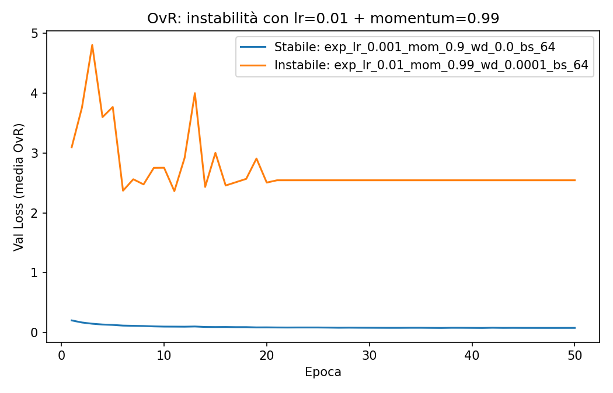

**Meccanismo:**
- Learning rate alto (0.01): moltiplica un gradiente già amplificato 40x dal `pos_weight`, producendo un passo di aggiornamento enorme.
- Momentum alto (0.99): la velocità accumulata nei passi precedenti decade molto lentamente (99% mantenuto ad ogni step); se i primi passi sono già sovradimensionati dal `pos_weight`, il momentum li accumula invece di smorzarli.

Il risultato è un ciclo che si autoalimenta: un passo eccessivo spinge il modello a predire con grande confidenza, ma in modo sbagliato, su qualche esempio positivo → la BCE loss di quell'esempio, non limitata superiormente, esplode → moltiplicata per 40 diventa ancora più grande → il gradiente successivo cresce a sua volta → il momentum lo accumula ulteriormente. È una spirale.

Per indagare l'origine di questa instabilità è stata analizzata la loss di ciascuno dei 43 classificatori **al proprio checkpoint migliore** — l'unico effettivamente salvato su disco (`logistic_class_i.pth`), poiché in `training.py` il salvataggio avviene solo quando la loss migliora, mai all'ultima epoca — sulla configurazione instabile `lr=0.01, mom=0.99, wd=0.0001, bs=64`. Questa analisi è indipendente dalla curva aggregata mostrata sopra (che riflette la traiettoria grezza epoca-per-epoca, non i checkpoint migliori): l'obiettivo è isolare la capacità reale di ciascun classificatore, non scomporre un valore specifico di quella curva. La media dei 43 valori riportati sotto (≈1.10) non è quindi direttamente confrontabile con i numeri del grafico.

Statistiche sulla loss di validation dei 43 classificatori:

| Statistica | Valore |
| --- | --- |
| Media | 1.10 |
| Mediana | 0.32 |
| Min | ~0.00 |
| Max | 10.04 |
| Deviazione standard | 1.96 |

Il gap tra media (1.10) e mediana (0.32) è la firma tipica di una distribuzione dominata da outlier: la maggioranza dei classificatori si comporta bene, pochi trascinano la media.

- 21 classi su 43 (quasi la metà) hanno loss < 0.3 (range sano).
- 9 classi su 43 hanno loss > 1.0, con valori estremi: classe 1 (10.04), classe 2 (5.90), classe 7 (4.20), classe 5 (4.20), classe 8 (3.46), classe 4 (3.25), classe 25 (2.98), classe 3 (2.64).

La classe 2, seconda peggiore, è anche la classe più frequente del dataset (2.250 immagini in train). Se la causa principale fosse lo sbilanciamento, ci si aspetterebbe il contrario. Questo indica che il collasso non dipende (solo) dallo sbilanciamento, ma dalla dinamica di ottimizzazione stessa — inizializzazione casuale più la spirale lr/momentum/pos_weight descritta sopra — che può colpire qualsiasi classificatore indipendentemente dalla frequenza della sua classe.

Loss di validation per ciascuna delle 43 classi (config instabile `lr=0.01, mom=0.99, wd=0.0001, bs=64`):

| Classe | Loss | Shape | Color | Stato |
| --- | --- | --- | --- | --- |
| 1 | 10.039 | 1 | 0 | ESPLOSA |
| 2 | 5.899 | 1 | 0 | ESPLOSA |
| 7 | 4.199 | 1 | 0 | ESPLOSA |
| 5 | 4.196 | 1 | 0 | ESPLOSA |
| 8 | 3.455 | 1 | 0 | ESPLOSA |
| 4 | 3.251 | 1 | 0 | ESPLOSA |
| 25 | 2.981 | 0 | 0 | ESPLOSA |
| 3 | 2.641 | 1 | 0 | ESPLOSA |
| 11 | 1.542 | 0 | 0 | ESPLOSA |
| 10 | 0.868 | 1 | 0 | elevata |
| 38 | 0.851 | 1 | 1 | elevata |
| 28 | 0.717 | 0 | 0 | elevata |
| 9 | 0.699 | 1 | 0 | elevata |
| 30 | 0.684 | 0 | 0 | elevata |
| 34 | 0.680 | 1 | 1 | elevata |
| 23 | 0.605 | 0 | 0 | elevata |
| 18 | 0.530 | 0 | 0 | elevata |
| 31 | 0.490 | 0 | 0 | sana |
| 0 | 0.415 | 1 | 0 | sana |
| 39 | 0.368 | 1 | 1 | sana |
| 20 | 0.326 | 0 | 0 | sana |
| 27 | 0.316 | 0 | 0 | sana |
| 21 | 0.276 | 0 | 0 | sana |
| 37 | 0.273 | 1 | 1 | sana |
| 33 | 0.205 | 1 | 1 | sana |
| 36 | 0.195 | 1 | 1 | sana |
| 26 | 0.178 | 0 | 0 | sana |
| 42 | 0.120 | 1 | 3 | sana |
| 19 | 0.109 | 0 | 0 | sana |
| 35 | 0.090 | 1 | 1 | sana |
| 24 | 0.071 | 0 | 0 | sana |
| 41 | 0.039 | 1 | 3 | sana |
| 40 | 0.028 | 1 | 1 | sana |
| 29 | 0.026 | 0 | 0 | sana |
| 16 | 0.025 | 1 | 0 | sana |
| 14 | 0.018 | 3 | 0 | sana |
| 12 | 0.010 | 2 | 2 | sana |
| 13 | 0.007 | 4 | 0 | sana |
| 22 | 0.004 | 0 | 0 | sana |
| 6 | 0.002 | 1 | 3 | sana |
| 32 | 0.002 | 1 | 3 | sana |
| 17 | 0.000 | 1 | 0 | sana |
| 15 | 0.000 | 1 | 0 | sana |

| Gruppo (ShapeId+ColorId) | Dimensione gruppo | Classi esplose nel gruppo | Tasso di esplosione |
| --- | --- | --- | --- |
| Cerchio rosso (limiti di velocità/divieti: classi 0,1,2,3,4,5,7,8,9,10,15,16,17) | 13 classi | 1, 2, 3, 4, 5, 7, 8 (7 su 9 esplose!) | 53.8% |
| Triangolo rosso (segnali di pericolo: 11,18-31) | 15 classi | 11, 25 | 13.3% |
| Tutte le altre 15 classi | 15 classi | nessuna | 0% |

7 delle 9 classi esplose (1, 2, 3, 4, 5, 7, 8) appartengono allo stesso gruppo visivo — i segnali circolari rossi (limiti di velocità e divieti), molto simili tra loro (stessa forma, stesso colore, differiscono solo nel simbolo centrale). In quel gruppo di 13 classi il tasso di esplosione è del 53.8%; nel resto del dataset (30 classi) è quasi nullo (2/30).

La causa è nella rappresentazione: classi visivamente simili producono embedding ResNet18 più sovrapposti nello spazio a 512 dimensioni, quindi un confine di decisione più stretto e ambiguo tra positivo e negativo — più occasioni per un errore iniziale ad alta confidenza, l'innesco necessario per la spirale descritta sopra.

Emerge così una fragilità strutturale dell'OvR: i 43 classificatori sono completamente indipendenti, ciascuno con la propria traiettoria di ottimizzazione. Se uno di essi imbocca la spirale, nulla nel sistema lo trattiene. Un modello che osserva le classi congiuntamente (Softmax) è invece strutturalmente più robusto a questo tipo di collasso, perché non scompone il problema in decisioni isolate; con iperparametri normali, un errore isolato viene assorbito e il training si riprende regolarmente.

Coerentemente, il momentum ottimale differisce tra i due modelli (0.9 per l'OvR, 0.99 per il Softmax): l'ottimo dell'OvR è abbassato specificamente dai sotto-problemi fragili (le classi visivamente confondibili) nascosti dentro la media.

3. **La val_acc dell'OvR non è una metrica affidabile per il model selection.** Anche nelle configurazioni peggiori (dove la val_loss esplode a 2.36), la val_acc media dell'OvR resta comunque alta (96-98%). Questo è dovuto allo sbilanciamento intrinseco di ogni sotto-problema binario: un classificatore che predice quasi sempre "negativo" ottiene comunque un'accuracy elevata semplicemente perché i negativi sono la stragrande maggioranza (accuracy paradox) (vedi [Valverde-Albacete & Peláez-Moreno, 2014](#riferimenti)). Per questo motivo, per confrontare le configurazioni dell'OvR è stata usata la val_loss piuttosto che la val_acc.

4. **Weight decay ha un impatto marginale** nell'intervallo testato (0 vs 0.0001): a parità di lr/momentum/batch_size, la differenza in val_loss è generalmente piccola, suggerendo che l'overfitting non è il problema dominante in questo setup (modelli lineari su 512 feature, dataset relativamente ampio).

### Confronto Softmax vs OvR sul test set

Le due configurazioni ottimali (scelte esclusivamente su validation, sezione precedente) sono state valutate sul test set ufficiale (12.630 immagini), usando `evaluate_softmax` e `evaluate_ovr_global`:

| Modello | Config ottimale | Val Loss | Val Acc | **Test Acc** |
|---|---|---|---|---|
| Softmax | lr=0.001, mom=0.99, wd=0.0, bs=64 | 0.152 | 95.27% | **86.63%** |
| OvR | lr=0.001, mom=0.9, wd=0.0, bs=64 | 0.075 | 98.67% | **85.39%** |

**Nota metodologica sulla colonna Val Loss**: i due valori (0.152 per Softmax, 0.075 per OvR) **non sono confrontabili tra loro** e non vanno letti come "l'OvR ha una loss migliore". Softmax usa `CrossEntropyLoss` su una distribuzione a 43 vie, mentre OvR usa la media di 43 `BCEWithLogitsLoss` binarie con `pos_weight=40` — due funzioni di loss diverse, su scale diverse, che misurano cose diverse. La val_loss è stata usata **solo per la ricerca degli iperparametri all'interno di ciascuna famiglia** (config Softmax confrontate tra loro, config OvR confrontate tra loro — sezione precedente); è riportata qui solo a titolo informativo, non come base del confronto. L'unico confronto valido e alla pari tra Softmax e OvR è quello sulla **Test Acc**, che è la stessa identica metrica (accuracy multiclasse) per entrambi i modelli — su questa base il Softmax risulta leggermente migliore dell'OvR sul test set (+1.24 punti percentuali).

**Osservazione**: entrambi i modelli mostrano un calo netto tra validation e test accuracy (Softmax: -8.6pt, OvR: -13.3pt), più marcato per l'OvR. Poiché validation e training provengono dallo stesso split (80/20 stratificato sul train ufficiale), mentre il test è una raccolta separata del dataset GTSRB, questo suggerisce una differenza di distribuzione tra train/val e test (es. condizioni di acquisizione, illuminazione, sequenze video diverse) più che overfitting classico — coerente con la caratteristica nota di GTSRB per cui train e test provengono da sequenze di tracce diverse. Il calo maggiore dell'OvR è plausibilmente legato alla sua maggiore sensibilità allo sbilanciamento (già osservata durante la grid search): un piccolo spostamento nella distribuzione dei negativi/positivi pesa di più su 43 decisioni binarie indipendenti che su un'unica decisione softmax. Questa ipotesi andrebbe verificata con l'analisi per-classe (sezione seguente).

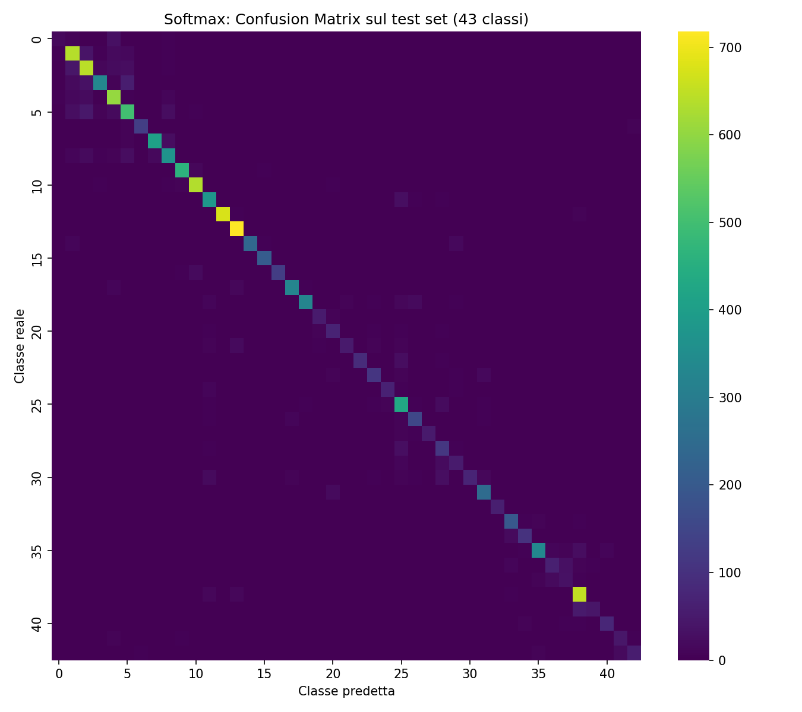

Guardando le matrici di confusione: Notiamo come le caselle "fuori dalla diagonale" si addensano vicino alle classi 0-8 (i limiti di velocità/segnali circolari, che si assomigliano visivamente).

### MLP

Allenato un `MLPClassifier` (`Linear(512→hidden) → ReLU → Dropout → Linear(hidden→43)`) con `CrossEntropyLoss`, stessa procedura SGD+early stopping di Softmax/OvR. Griglia: `hidden_size`∈{64,128,256}, `learning_rate`∈{0.01,0.001}, `momentum`∈{0.9,0.99}, `dropout`∈{0.0,0.3} (24 configurazioni), `weight_decay=0` e `batch_size=64` fissati (vedi motivazione in Metodi). Selezione della config migliore su **val_loss**, stesso criterio di Softmax (entrambi ottimizzano `CrossEntropyLoss`, quindi qui il confronto diretto delle loss è legittimo — a differenza del confronto Softmax/OvR discusso sopra, che usa due loss diverse).

È l'unico modello del progetto con un layer nascosto e una non-linearità (ReLU): tutti gli altri sette — Softmax/OvR inclusi — sono lineari nell'input. Ci si aspetta quindi che sia potenzialmente il modello più espressivo, con il rischio di overfitting più alto da tenere sotto controllo (da qui il dropout in griglia).

**Configurazione migliore (selezione su validation loss)**: `hidden_size=256, lr=0.01, momentum=0.9, dropout=0.3` → **val_loss = 0.099**, val_acc = 96.77%.

**Test set**: **Test Accuracy = 88.12%** (contro 96.77% di val_acc, gap **-8.65pt**). È il **miglior risultato su test di tutto il progetto**, leggermente sopra SVM Lineare (87.47%) e Softmax (86.63%) — coerente con l'aspettativa che, essendo l'unico modello non lineare, l'MLP possa catturare pattern che i modelli lineari non colgono, pur restando comunque un modello semplice (un solo hidden layer) e quindi meno esposto all'overfitting rispetto a un albero senza vincoli o a un kernel RBF molto flessibile.

**Gap val→test dell'MLP**: la config vincente dell'MLP non usa alcuna pesatura per lo sbilanciamento (`CrossEntropyLoss` senza `weight`); il suo gap è **-8.65pt**, vicino a quello del Softmax (-8.64pt, anch'esso senza pesatura). Il confronto con gli altri sei modelli — inclusi quelli con pesatura, necessario per valutare l'ipotesi che la pesatura allarghi il gap — è nella sezione **Riepilogo** a fine capitolo Esperimenti, una volta presentati tutti i modelli.

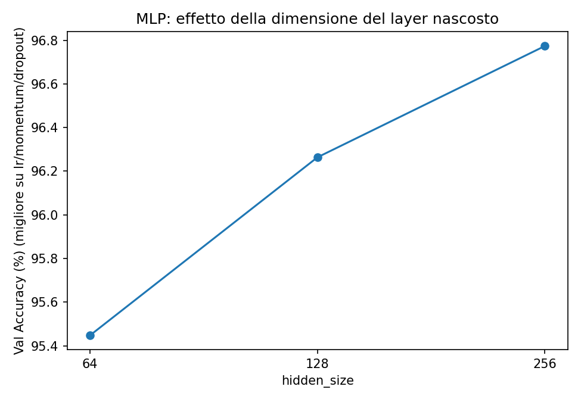
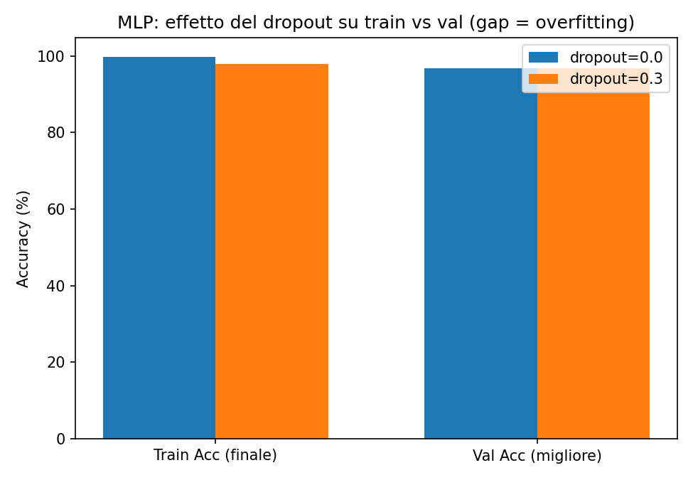

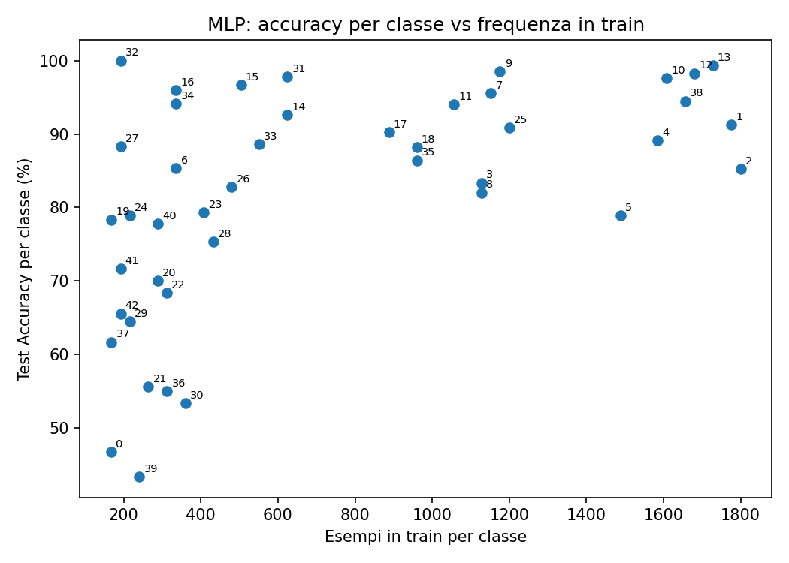

### Analisi delle curve di training: Train vs Val (Softmax, OvR, MLP)

Softmax, OvR e MLP sono gli unici tre modelli allenati per epoche con SGD, quindi sono gli unici per cui ha senso guardare l'andamento **train vs val nel tempo** sullo stesso modello, e confrontare le curve di **val accuracy tra modelli diversi**.

**Softmax** (`curve_softmax_best.png`):

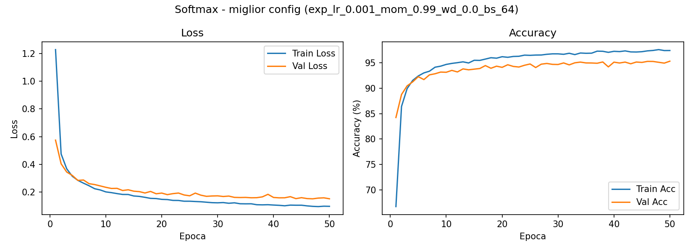

- Loss: la val si stabilizza in modo simile alla train, su un valore leggermente più alto, con piccole oscillazioni fino all'ultima epoca.
- Accuracy: la val si stabilizza in modo simile alla train, su un valore minimamente più basso, e resta sotto la train per la maggior parte del tempo.
- **Lettura**: è la firma di un training sano con un piccolo gap di generalizzazione fisiologico. Il gap piccolo e persistente è coerente con quanto già osservato sul weight decay (impatto marginale, l'overfitting non è il problema dominante per un modello lineare su 512 feature).

**OvR** (`curve_ovr_best.png` — **ricorda: è la media di 43 modelli indipendenti**, non un singolo training):

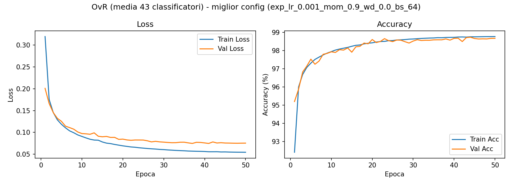

- Loss: stesso pattern del Softmax — val si stabilizza vicino alla train, leggermente più alta, piccole oscillazioni fino alla fine.
- Accuracy: val si stabilizza vicino alla train, minimamente più bassa, **ma in alcune epoche intermedie, oscillando, la supera**.
- **Lettura (il punto interessante)**: perché la val accuracy dovrebbe mai superare la train, se allenata sugli stessi dati per lo stesso modello? Perché qui "train_acc" e "val_acc" non sono di un solo modello ma **medie su 43 classificatori che si fermano in momenti diversi** (ciascuno col proprio early stopping). A una data epoca intermedia, alcuni dei 43 hanno già smesso di allenarsi (bloccati sul loro miglior checkpoint, quindi contribuiscono alla media val col loro punteggio migliore), mentre altri stanno ancora aggiornando i pesi su mini-batch rumorosi (quindi la loro train_acc di quella specifica epoca riflette rumore SGD, non la loro prestazione migliore). Il sorpasso occasionale è un **artefatto della media su 43 modelli asincroni**, non un segnale che il validation set sia "più facile" del train.

**MLP** (`mlp_curve_best.png`):

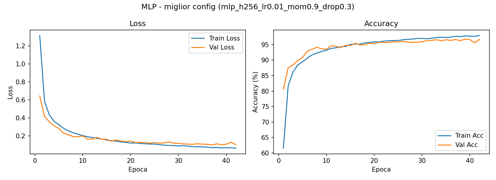

- Loss: la val si stabilizza quasi subito con la train; a metà training sono quasi identiche; verso la fine (epoca 50) la val torna leggermente più alta.
- Accuracy: la val si stabilizza quasi subito con la train; a metà training le due curve sono quasi perfettamente sovrapposte (nonostante piccole oscillazioni); alla fine la val è leggermente sotto la train.
- Ho notato che inizialmente MLP nel Validation supera l'accuracy del training (primissime epoche)
`Spiegazione`:  la config vincente dell'MLP ha dropout=0.3. Durante il training, il dropout spegne casualmente il 30% dei neuroni del layer nascosto ad ogni passaggio — il modello lavora con alcune sue capacità spente apposta. Durante la validation (model.eval()), il dropout si disattiva completamente — il modello lavora a piena potenza, con tutti i neuroni attivi.
Quindi il modello non generalizza "meglio" nella validation rispetto che nel training (fuorviante) — è che la misurazione stessa del train_acc è penalizzata artificialmente dal dropout, mentre quella della val_acc no. 
- **Lettura**: l'MLP converge **più in fretta** di Softmax/OvR (le curve si "stabilizzano quasi subito" invece di avvicinarsi gradualmente) — coerente con la sua config vincente che usa un learning rate più alto (0.01 contro 0.001 del Softmax) e con la maggiore capacità del modello (hidden layer + ReLU). Il fatto che il gap train/val resti comunque piccolo nonostante l'MLP sia strutturalmente più espressivo (l'unico modello non lineare del progetto) è la conferma empirica che il `dropout=0.3` della config vincente sta facendo il suo lavoro di regolarizzazione.

**Confronto diretto Val Accuracy: MLP vs Softmax** (`softmax_vs_mlp_val_acc.png`):

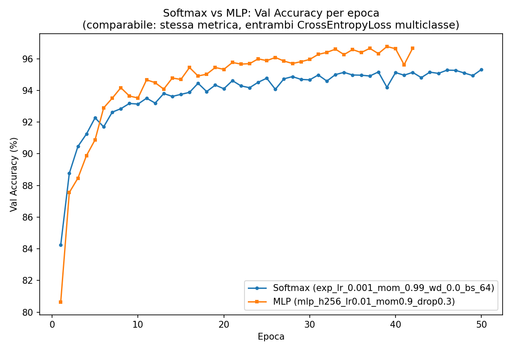

- Nelle prime epoche l'MLP ha val accuracy **più bassa** del Softmax, poi lo supera e si conferma migliore per il resto del training.
- L'ampiezza delle oscillazioni di Softmax e MLP è praticamente identica — nonostante l'MLP abbia più parametri e un learning rate più alto, non introduce instabilità visibile in più rispetto al modello lineare.
- **Lettura**: il ritardo iniziale dell'MLP è atteso — il suo hidden layer parte da pesi casuali e deve prima "organizzarsi" in una rappresentazione utile dei 512 embedding prima che il layer finale possa classificare bene; il Softmax, non avendo questo passaggio intermedio, parte già "pronto" a sfruttare gli embedding così come sono. Una volta che l'MLP ha organizzato la sua rappresentazione interna, la capacità e la non-linearità in più gli danno un vantaggio stabile — coerente col fatto che l'MLP finisce per essere il modello con la **miglior test accuracy di tutto il progetto** (88.12%).

**Instabilità dell'OvR** (`ovr_instabilita.png`, confronto tra la config vincente e `lr=0.01, mom=0.99, wd=0.0001, bs=64`):

- Nella config instabile, la curva collassa e si **appiattisce perfettamente dall'epoca ~21** in poi (val_loss fissa a 2.544, verificato sui dati grezzi) — segno che tutti e 43 i classificatori hanno smesso di allenarsi presto (early stopping scattato per l'intero gruppo entro le prime ~20 epoche), su un risultato pessimo. Nella config stabile, invece, non si osserva mai una stabilizzazione così netta: la curva continua a muoversi leggermente fino all'epoca 50, segno che i 43 classificatori si fermano in momenti diversi e sparsi lungo quasi tutto il training, non tutti insieme e in anticipo.

### Decision Tree

Allenato `sklearn.tree.DecisionTreeClassifier` sugli stessi 512 embedding, con una grid search di 48 configurazioni:

| Iperparametro | Valori testati |
|---|---|
| max_depth | None, 10, 20, 30 |
| min_samples_leaf | 1, 5, 20 |
| criterion | gini, entropy |
| class_weight | None, 'balanced' |

`class_weight='balanced'` è stato incluso per lo stesso motivo del `pos_weight=40` dell'OvR (contrastare lo sbilanciamento delle classi), come test, non come scelta già data per scontata.

**Configurazione migliore (selezione su validation accuracy)**: `max_depth=20, criterion=entropy, min_samples_leaf=1, class_weight=None` → **val_acc = 63.27%**, val_f1_macro = 0.576.

| Config (estratto) | val_acc | val_f1_macro |
|---|---|---|
| depth=20, leaf=1, entropy, cw=None (**migliore**) | **63.27%** | 0.576 |
| depth=20, leaf=5, entropy, cw=None | 63.21% | 0.579 |
| depth=None, leaf=1, entropy, cw=None | 63.13% | 0.574 |
| depth=30, leaf=1, entropy, cw=None | 63.13% | 0.574 |
| ... | | |
| depth=10, leaf=20, gini, cw=None | 51.90% | 0.434 |
| depth=10, leaf=1, gini, cw='balanced' | 42.12% | 0.426 |
| depth=10, leaf=20, gini, cw='balanced' (peggiore) | 41.55% | 0.413 |

*(tabella completa delle 48 configurazioni in `results/models_classical/decision_tree/grid_search_results.json`)*

**Osservazioni:**

1. **Un singolo albero è nettamente sotto Softmax/OvR** (63.27% di val_acc contro 95.27%/98.67%): un albero decisionale singolo, con confini di decisione "a gradini" allineati agli assi, fatica su 512 feature continue dense come un embedding CNN, a differenza dei modelli lineari che riescono a sfruttare combinazioni pesate di tutte le dimensioni contemporaneamente.
2. **`max_depth` è il fattore dominante**: con `max_depth=10` l'accuracy resta bloccata al 42-52%, mentre da profondità 20 in su si stabilizza intorno al 63% — indicando che con soli 10 livelli l'albero è troppo semplice (underfitting) per 43 classi, mentre oltre i 20 livelli i guadagni diventano marginali (l'albero ha già "esaurito" la capacità utile prima di overfittare in modo dannoso sulla validation).
3. **`class_weight='balanced'` peggiora sia l'accuracy sia il F1-macro** (fino al 41-51% contro il 63% del caso non pesato) — risultato opposto a quello osservato con `pos_weight=40` nell'OvR, dove pesare la classe minoritaria aiutava. Ipotesi: nell'OvR il pos_weight agisce su una loss continua (BCE) di un singolo confine binario per volta; in un Decision Tree il "peso" altera invece direttamente il criterio di split (gini/entropy pesati), spingendo l'albero a creare foglie pure sulle classi rare a scapito della qualità complessiva degli split — un effetto strutturalmente diverso, da verificare meglio con l'analisi per-classe.
4. `min_samples_leaf` ha un impatto minore rispetto a `max_depth` e `class_weight`, nel range testato.

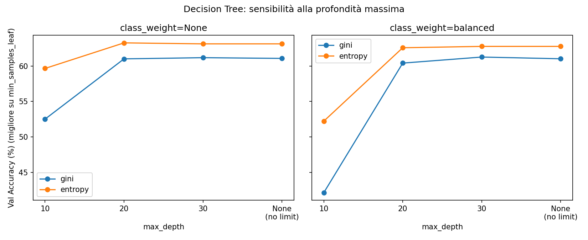
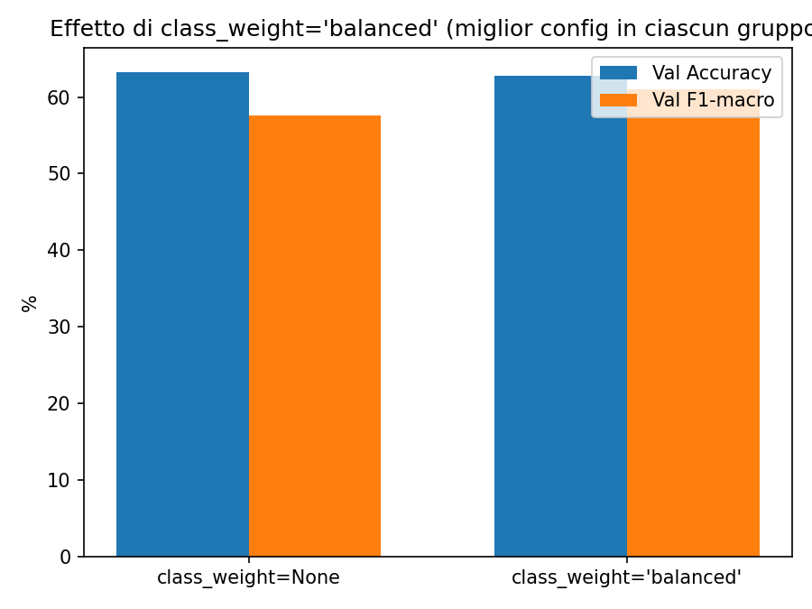
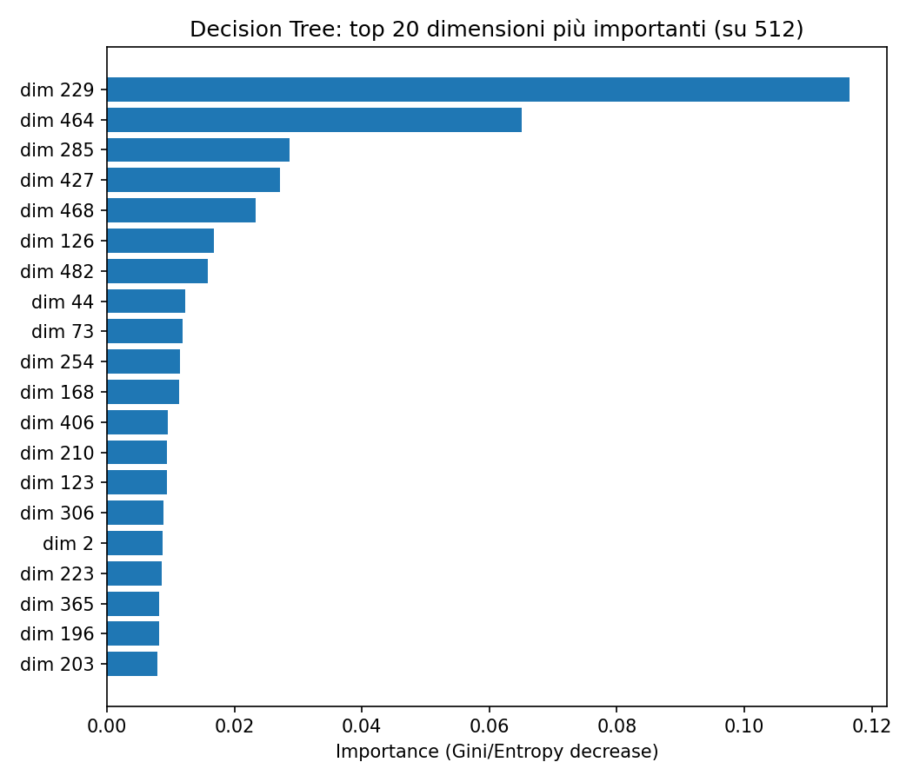
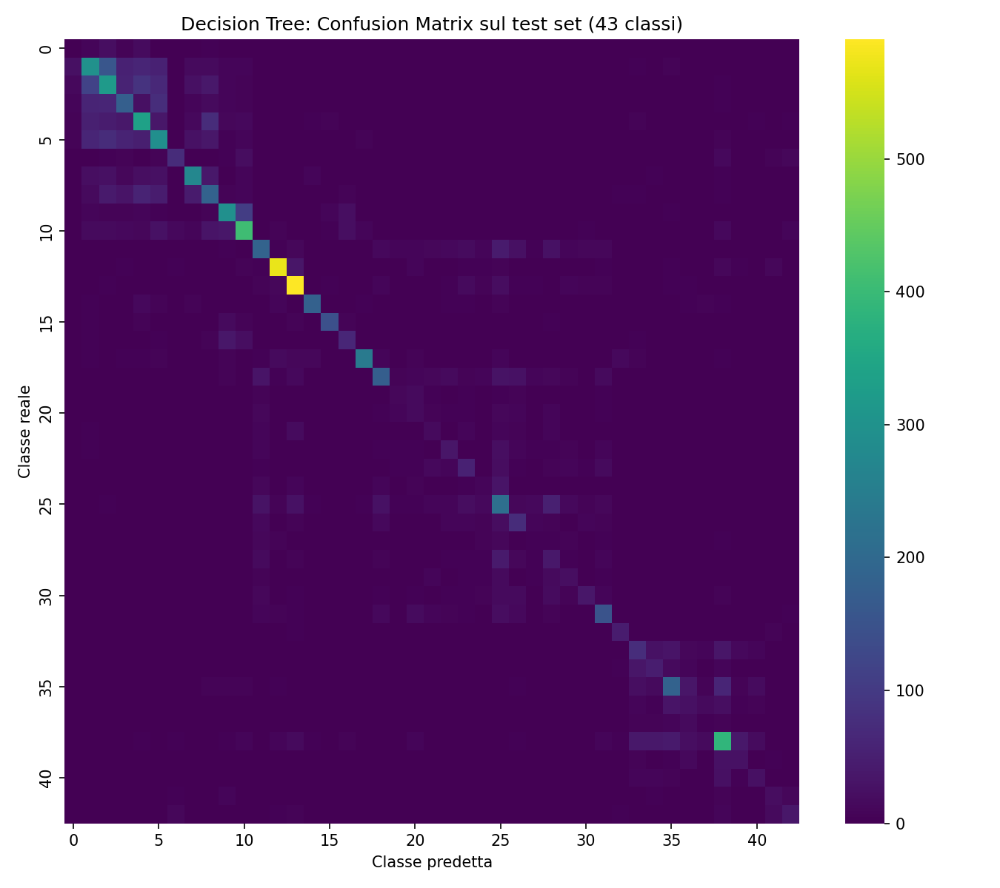
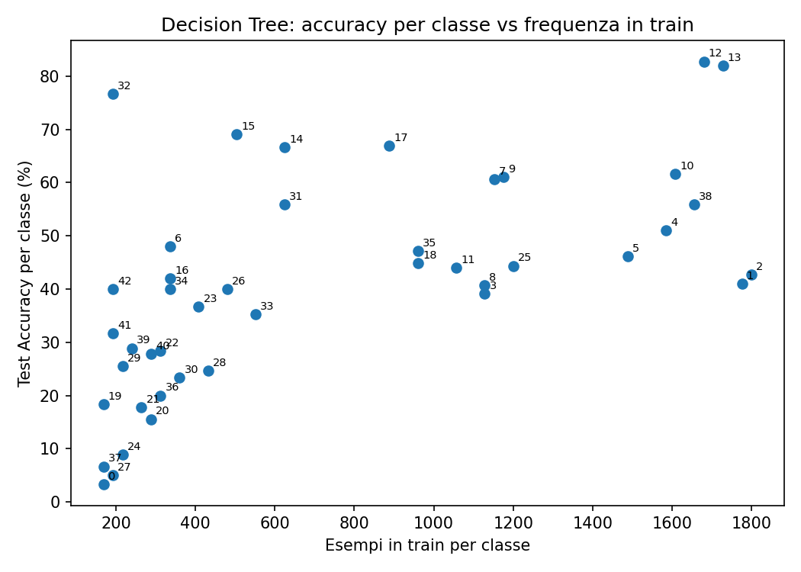

**Test set**: **Test Accuracy = 50.22%** (contro 63.27% di val_acc, gap di -13.05pt). È il calo più marcato tra tutti i modelli assieme a OvR e SVM RBF (si veda il riepilogo a fine sezione Esperimenti) — coerente con l'aspettativa: un Decision Tree senza vincoli di profondità (`max_depth=20`) si adatta a dettagli specifici del validation set usato per la selezione, che non si ritrovano allo stesso modo nel test.

### Random Forest

Allenato `sklearn.ensemble.RandomForestClassifier` sugli stessi embedding, come ensemble di Decision Tree per superare il limite del singolo albero osservato sopra.

**Scelta della griglia**: invece di ripetere la stessa griglia a 4 valori di `max_depth` usata per il Decision Tree, la griglia è stata ridotta usando le conclusioni già ottenute lì — `max_depth=10` è già chiaramente peggiore (osservazione 2 sopra) e non serve ritestarlo:

| Iperparametro | Valori testati | Motivazione |
|---|---|---|
| n_estimators | 100, 300 | numero di alberi nell'ensemble |
| max_depth | 20, None | 10 escluso: già chiaramente peggiore nel Decision Tree; 30 escluso perché ≈20≈None nel Decision Tree |
| min_samples_leaf | 1, 5 | ridotto rispetto al DT (20 dava foglie troppo grossolane) |
| class_weight | None, 'balanced' | ritestato apposta: un ensemble può reagire diversamente allo sbilanciamento rispetto a un singolo albero |
| criterion | entropy (fisso) | era il criterio migliore nel Decision Tree |

Totale: 16 configurazioni (contro le 48 del Decision Tree), stessa disciplina train/val/test.

**Configurazione migliore (selezione su validation accuracy)**: `n_estimators=300, max_depth=None, min_samples_leaf=5, class_weight='balanced'` → **val_acc = 92.29%**, val_f1_macro = 0.931.

| Config (estratto) | val_acc | val_f1_macro |
|---|---|---|
| n=300, depth=None, leaf=5, cw=balanced (**migliore**) | **92.29%** | 0.931 |
| n=300, depth=20, leaf=5, cw=balanced | 92.09% | 0.929 |
| n=300, depth=20, leaf=1, cw=balanced | 91.71% | 0.911 |
| n=300, depth=20, leaf=1, cw=None | 91.41% | 0.900 |
| ... | | |
| n=300, depth=None, leaf=5, cw=None | 88.87% | 0.860 |
| n=100, depth=None, leaf=5, cw=None (peggiore) | 88.20% | 0.852 |

*(tabella completa delle 16 configurazioni in `results/models_classical/random_forest/grid_search_results.json`)*

**Osservazioni:**

1. **L'ensembling recupera quasi tutto il distacco da Softmax/OvR**: il salto rispetto al Decision Tree singolo è enorme, dal 63.27% al 92.29% di val_acc (+29 punti), confermando l'aspettativa che mediare su molti alberi (qui 300) riduca drasticamente la varianza del singolo albero, che con un solo split-set tendeva a "impegnarsi" troppo su porzioni specifiche dello spazio delle feature.
2. **Ribaltamento sorprendente sul `class_weight`**: nel Decision Tree, `class_weight='balanced'` *peggiorava* nettamente i risultati (fino a -20pt). Nel Random Forest succede l'esatto opposto: `class_weight='balanced'` **aiuta sempre**... Ipotesi: nel singolo albero pesare gli split distorce eccessivamente la struttura di quell'unico albero; mediando su centinaia di alberi diversi (bootstrap + feature sampling), il Random Forest assorbe questa distorsione localizzata — coerente con il principio generale per cui l'ensembling riduce la varianza dei singoli classificatori, sebbene l'interazione specifica con `class_weight` osservata qui non sia direttamente documentata in letteratura ed emerga dall'analisi di questo progetto.
3. **Interazione `min_samples_leaf` × `class_weight`**: `min_samples_leaf=5` è la scelta migliore solo se combinato con `class_weight='balanced'`; con `class_weight=None`, invece, `min_samples_leaf=1` è nettamente meglio (la combinazione leaf=5 + cw=None è la peggiore di tutta la griglia).
4. `n_estimators=300` batte sempre `100` (atteso: più alberi, ensemble più stabile). `max_depth=None` e `max_depth=20` restano quasi equivalenti, come già osservato per il Decision Tree.

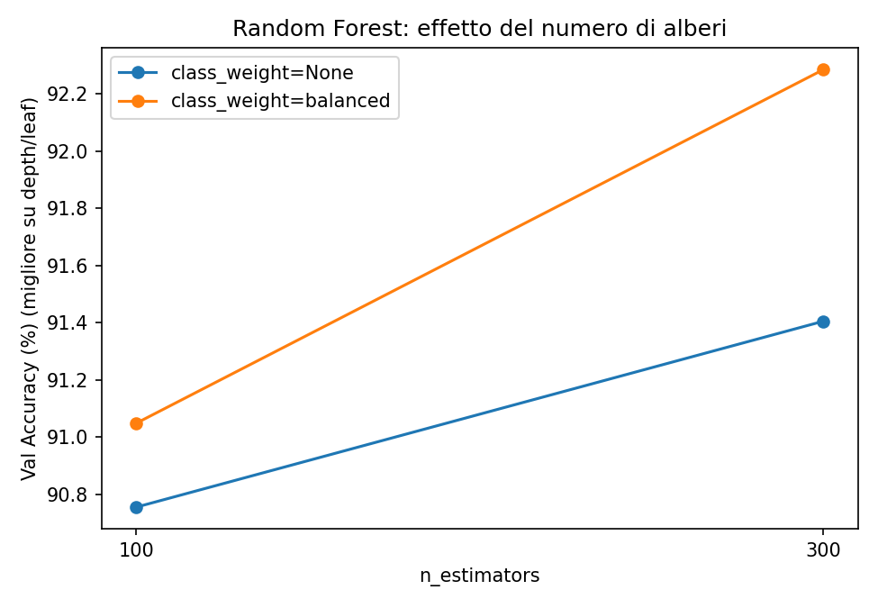
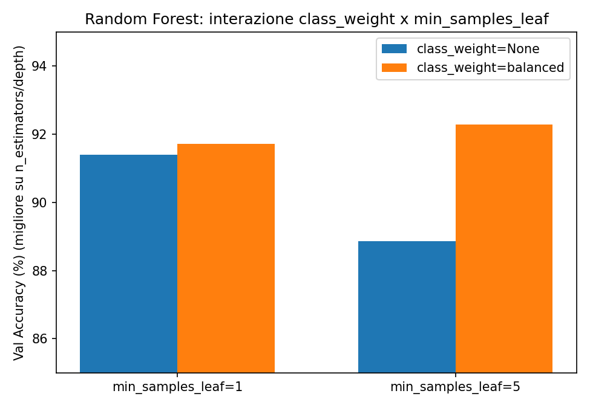
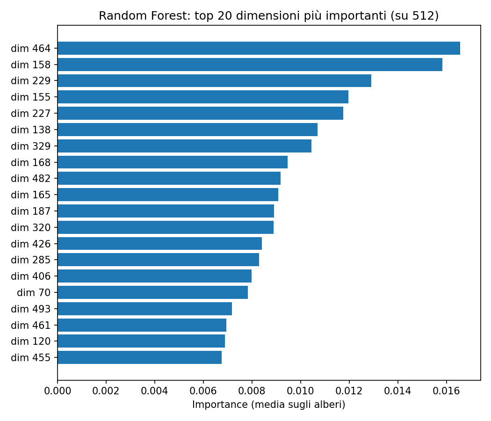

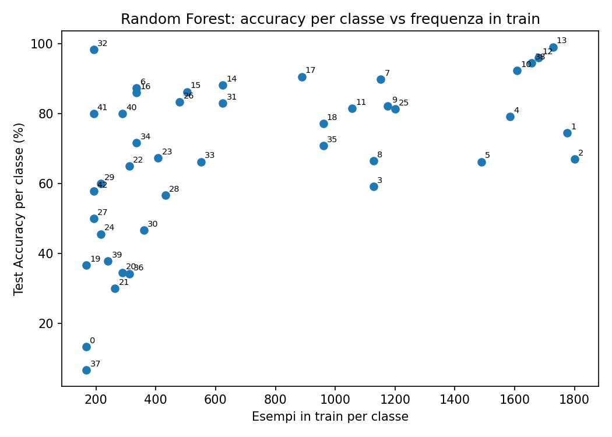
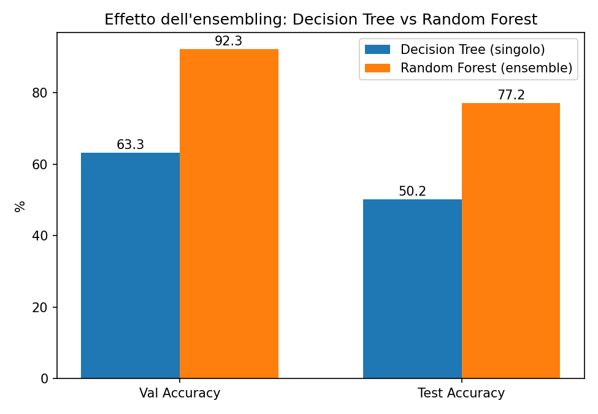

**Test set**: **Test Accuracy = 77.17%** (contro 92.29% di val_acc, gap **-15.12pt** — il più grande tra tutti e otto i modelli del progetto).

### SVM lineare e RBF

Allenati `sklearn.svm.LinearSVC` (lineare) e `sklearn.svm.SVC(kernel='rbf')` sugli stessi embedding, come due sotto-famiglie indipendenti.

**SVM Lineare** — griglia `C`∈{0.001,0.01,0.1,1,10} × `class_weight`∈{None,'balanced'} (10 config). **Configurazione migliore**: `C=0.1, class_weight=None` → **val_acc = 96.12%**, val_f1_macro = 0.971.

**SVM RBF** — griglia (ridotta per costo computazionale) `C`∈{1,10} × `gamma`∈{'scale',0.01} × `class_weight`∈{None,'balanced'} (8 config). **Configurazione migliore**: `C=10, gamma=0.01, class_weight='balanced'` → **val_acc = 98.51%**, val_f1_macro = 0.989.

| Modello | Config migliore | val_acc | val_f1_macro |
|---|---|---|---|
| SVM Lineare | C=0.1, cw=None | 96.12% | 0.971 |
| SVM RBF | C=10, gamma=0.01, cw=balanced | **98.51%** | 0.989 |

*(tabelle complete in `results/models_classical/svm/grid_search_results.json`)*

**Osservazioni:**

1. **RBF batte nettamente il lineare** (98.51% vs 96.12%, +2.4pt) — gli embedding ResNet18 non sono perfettamente separabili linearmente tra le 43 classi, e un confine di decisione curvo aiuta, come atteso dal comportamento generale del kernel trick su problemi non linearmente separabili (es. il classico dataset giocattolo `make_circles`).
2. **SVM RBF è, ad oggi, il modello con la validation accuracy più alta tra tutti quelli provati** (98.51%), praticamente alla pari con l'OvR (98.67%) e ben sopra Softmax (95.27%).
3. **Il SVM Lineare batte il Softmax pur essendo anch'esso lineare** (96.12% vs 95.27%): stessa famiglia di confine di decisione, ma loss (hinge vs cross-entropy) e ottimizzatore (liblinear/dual coordinate descent vs SGD+momentum) diversi — un promemoria che "lineare" non vuol dire "stesso risultato", la procedura di ottimizzazione conta.
4. **`class_weight='balanced'` ha un effetto trascurabile sulla SVM** (differenze nell'ordine di 0.1-0.5pt in entrambe le varianti) — a differenza del Decision Tree (dove peggiorava nettamente) e del Random Forest (dove aiutava chiaramente). Mettendo insieme le tre osservazioni: lo stesso accorgimento per lo sbilanciamento ha effetto **opposto o nullo** a seconda del modello a valle — quindi proprietà dataset↔modello. 
5. **Sensibilità agli iperparametri**: per il lineare, il valore intermedio `C=0.1` è il migliore (troppo basso, C=0.001, sotto-regolarizza poco il margine e scende a ~93%; troppo alto, C=10, scende a ~95%). Per l'RBF, sia `C=10` sia `gamma=0.01` battono sistematicamente i valori più bassi/di default (`gamma='scale'`) testati

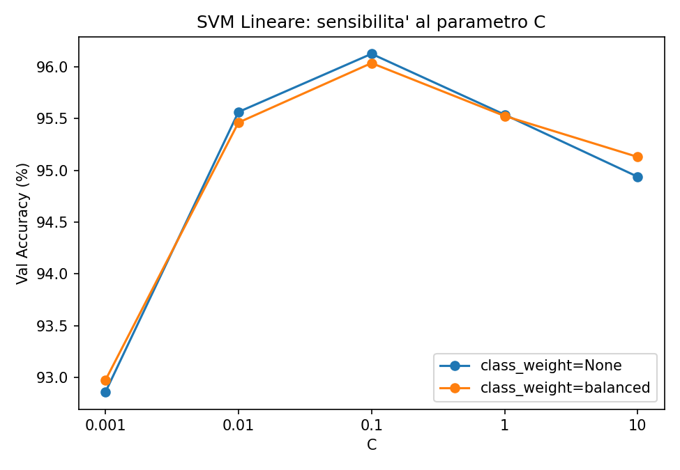
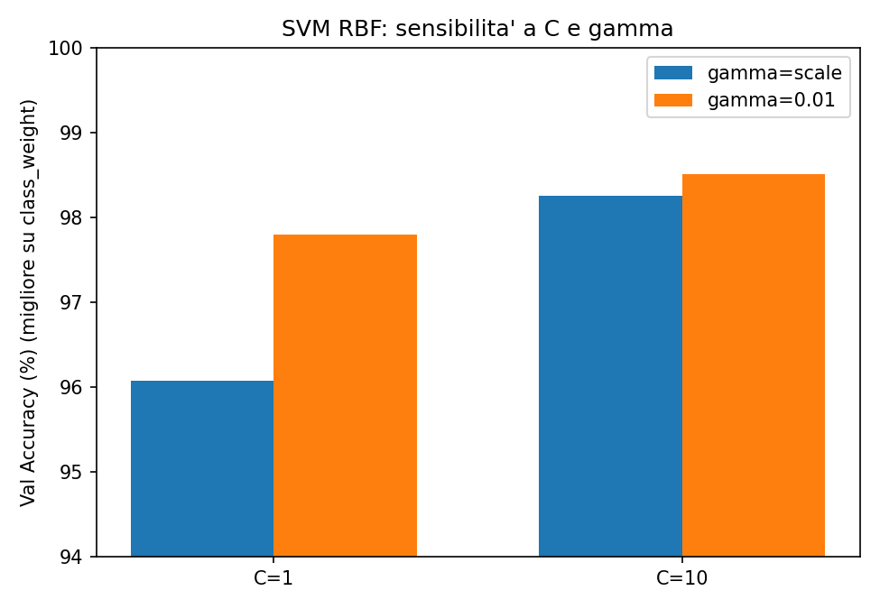

**Test set**: **SVM Lineare = 87.47%** (contro 96.12% val_acc, gap -8.65pt), **SVM RBF = 84.85%** (contro 98.51% val_acc, gap -13.66pt).

**Osservazione importante — la classifica si ribalta rispetto alla validation**: su validation l'RBF (98.51%) batteva nettamente il lineare (96.12%). Sul test succede l'esatto opposto: il **lineare (87.47%) batte l'RBF (84.85%)**, e batte anche il Softmax (86.63%) — diventando il miglior modello tra tutti quelli con score alto su validation. Il confine più flessibile dell'RBF, che si adattava meglio ai dati di validation, generalizza peggio sul test: l'overfitting dell'RBF non è causato dalla pesatura dello sbilanciamento come in altri modelli, ma dalla non linearità del kernel, che ha creato confini decisionali troppo chiusi attorno ai dati di validation.

### AdaBoost

Allenato `sklearn.ensemble.AdaBoostClassifier` con **Decision Stump** come weak learner. Griglia: `max_depth` dello stump ∈{1,2,3}, `n_estimators`∈{50,100,200}, `learning_rate`∈{0.5,1.0}, `class_weight` dello stump∈{None,'balanced'} → 36 configurazioni.

**Scoperta metodologica (non un bug di tuning, un limite strutturale)**: uno stump vero e proprio (`max_depth=1`) è tipicamente presentato su un problema **binario** (es. `make_moons`, 2 classi). Un albero con `max_depth=1` ha esattamente **2 foglie**, quindi può predire **al massimo 2 classi diverse in totale**, indipendentemente dai dati. Le prime 12 configurazioni (tutte con `max_depth=1`) lo confermano:

| Config | Esito |
|---|---|
| depth=1, n=50, lr=0.5, cw=None | val_acc = 13.72% |
| depth=1, n=50, lr=0.5, cw=balanced | **FALLITA** (weak learner peggio del caso) |
| depth=1, n=50, lr=1.0, cw=None | val_acc = 14.96% |
| depth=1, n=50, lr=1.0, cw=balanced | **FALLITA** |
| depth=1, n=100, lr=0.5, cw=None | val_acc = 16.13% |
| depth=1, n=100, lr=0.5, cw=balanced | **FALLITA** |
| depth=1, n=100, lr=1.0, cw=None | val_acc = 16.30% |
| depth=1, n=100, lr=1.0, cw=balanced | **FALLITA** |
| depth=1, n=200, lr=0.5, cw=None | val_acc = 20.15% |
| depth=1, n=200, lr=0.5, cw=balanced | **FALLITA** |

*(pattern: con class_weight=None, val_acc sale lentamente con n_estimators ma resta pessima; con class_weight='balanced', fallisce sempre)*

**Perché `class_weight=None` "sopravvive" ma `'balanced'` fallisce sempre**: un `DecisionTreeClassifier` dentro AdaBoost combina due pesi moltiplicati insieme: il `class_weight` fisso che gli si passa, e il `sample_weight` che AdaBoost aggiorna a ogni round concentrandosi sugli esempi più difficili. Con `class_weight=None`, lo split dello stump segue la distribuzione reale (sbilanciata) delle classi e tende a isolare le classi più frequenti — pessimo su 43 classi, ma resta appena sopra la soglia minima richiesta dall'algoritmo SAMME per essere accettato come weak learner (soglia molto permissiva: errore pesato < (K-1)/K ≈ 97.7% per K=43 classi) [La regola di SAMME dice che il classificatore debole (lo stump) deve fare almeno un po' meglio del tirare a indovinare a caso. Con 43 classi, tirare a caso significa avere il 2.3% di probabilità di azzeccare (e il 97.7% di sbagliare).]. Con `class_weight='balanced'`, il peso fisso per compensare la rarità delle classi si somma al reweighting già aggressivo di AdaBoost: la distribuzione di pesi effettiva diventa ancora più concentrata su pochi esempi di classi rare, che uno stump capace di distinguere al più 2-4 classi totali non riesce a "prendere" — l'errore pesato supera la soglia minima e SAMME rifiuta il modello (le due tecniche di reweighting si sommano e amplificano il limite strutturale dello stump).

**Nota pratica sul costo computazionale**: le configurazioni che falliscono non lo fanno istantaneamente. `AdaBoostClassifier.fit()` esegue i round in sequenza (ogni round allena un albero vero su tutti i 31.367 campioni), e l'eccezione scatta solo dopo, probabilmente quando l'errore pesato supera la soglia durante uno dei round — quindi il tempo già speso per i round precedenti non viene recuperato.

**Esito finale della grid search**: 30 configurazioni completate, **6 fallite** — esattamente le 6 con `max_depth=1, class_weight='balanced'` previste dalla diagnosi sopra, a conferma che il meccanismo individuato è esattamente quello osservato.

**Configurazione migliore (selezione su validation accuracy)**: `max_depth=3, n_estimators=200, learning_rate=0.5, class_weight=None` → **val_acc = 52.19%**, val_f1_macro = 0.462.

| Config (estratto) | val_acc | val_f1_macro |
|---|---|---|
| depth=3, n=200, lr=0.5, cw=None (**migliore**) | **52.19%** | 0.462 |
| depth=3, n=200, lr=0.5, cw=balanced | 52.16% | 0.516 |
| depth=3, n=200, lr=1.0, cw=balanced | 49.95% | 0.466 |
| depth=3, n=100, lr=0.5, cw=balanced | 47.96% | 0.457 |
| ... | | |
| depth=2, n=50, lr=0.5, cw=balanced | 20.95% | 0.184 |
| depth=1, n=50, lr=0.5, cw=None (peggiore tra le riuscite) | 13.72% | 0.030 |

*(tabella completa delle 30 configurazioni riuscite + le 6 fallite in `results/models_classical/adaboost/grid_search_results.json`)*

**Osservazioni:**

1. **AdaBoost è il modello peggiore tra tutti quelli provati finora** (52.19% di val_acc) — sotto perfino il Decision Tree singolo senza vincoli di profondità (63.27%). A differenza del Random Forest, che fa bagging di alberi *profondi* e indipendenti, qui il boosting combina alberi volutamente *deboli* (depth≤3): su un problema a 43 classi, 200 round non bastano a compensare weak learner così limitati.
2. **Il modello non ha ancora saturato**: a parità di depth/lr/class_weight, `n_estimators=200` batte sempre `100` e `50` in modo consistente e crescente (mai un plateau) — segno che con più round (es. 500-1000, non testati per limiti di tempo) il risultato salirebbe probabilmente ancora. 
3. **`learning_rate=0.5` batte sistematicamente `learning_rate=1.0`** a parità di altri iperparametri (es. 52.19% vs 49.29% sulla config migliore per depth/n_estimators) — il learning_rate più alto (il default sklearn) converge peggio qui, non meglio: segno che sta facendo passi troppo aggressivi nell'aggiornare i pesi dei campioni.
4. **`class_weight` produce un quinto pattern, diverso da tutti gli altri modelli**: sull'accuracy l'effetto è trascurabile (52.19% vs 52.16% sulla config migliore), ma sul **val_f1_macro `'balanced'` è sistematicamente migliore** (0.516 vs 0.462 sulla config migliore, 0.457 vs 0.389 su n=100/lr=0.5/depth=3)

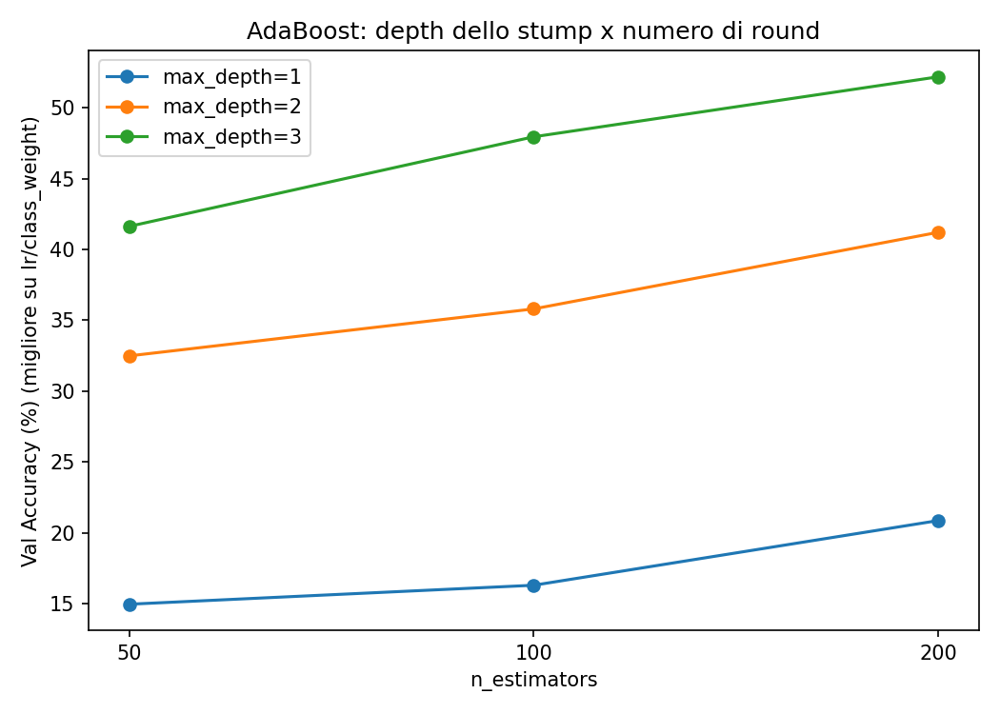
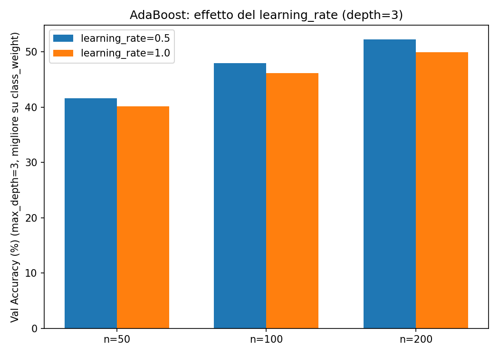
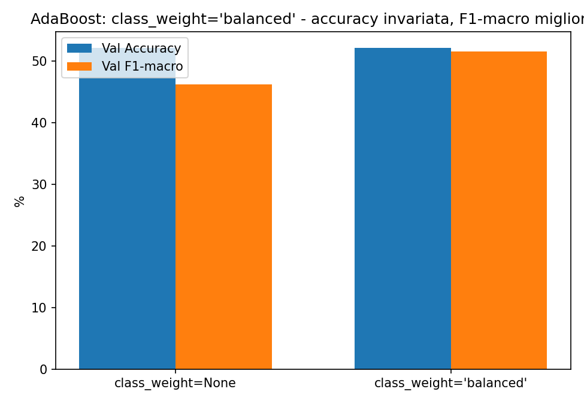

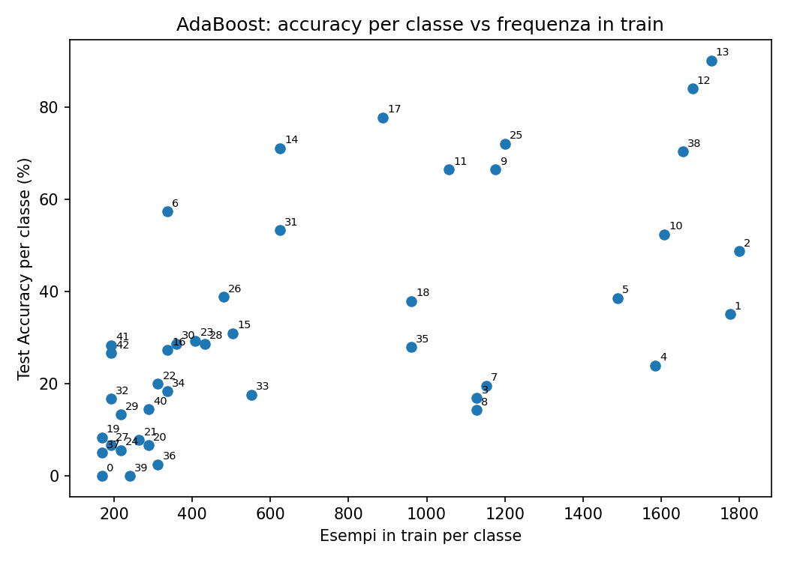

**Test set**: **Test Accuracy = 45.21%** (contro 52.19% di val_acc, gap -6.98pt — il più piccolo tra tutti i modelli). AdaBoost resta il modello più debole del progetto anche sul test.

### Analisi per-classe (Softmax e OvR)

Per verificare l'ipotesi avanzata sopra — il calo val→test più marcato dell'OvR è legato alla sua sensibilità allo sbilanciamento, perché pesare fortemente le classi rare in training fa sì che il modello si adatti troppo agli esempi rari specifici visti in train/val, e se il test contiene dati diversi per quelle stesse classi rare quell'adattamento iper-specifico non si trasferisce bene, amplificando il calo rispetto a un modello (Softmax) che non ha fatto questo sovra-adattamento mirato — si guarda l'accuracy di test **per singola classe** in funzione di quanti esempi quella classe aveva in train, per entrambi i modelli:

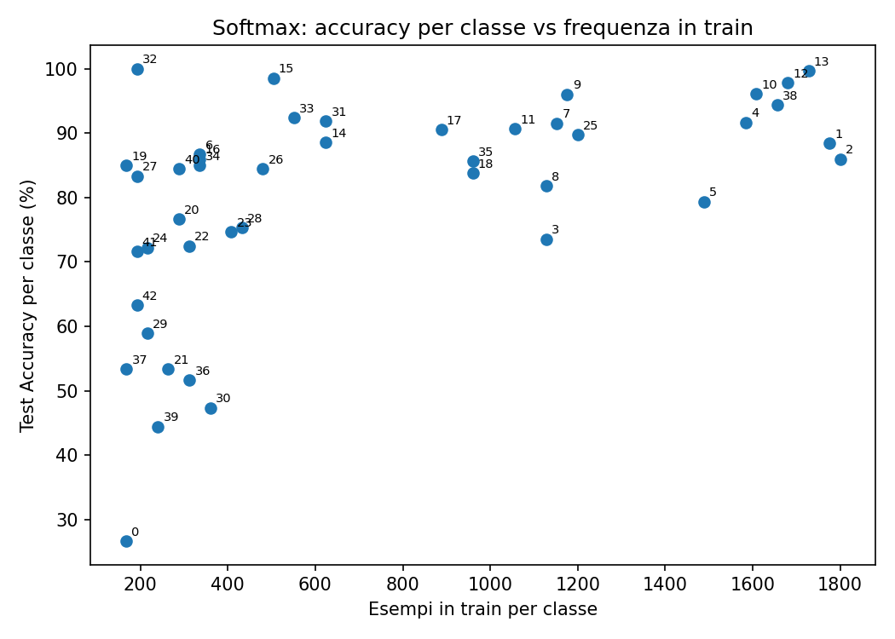
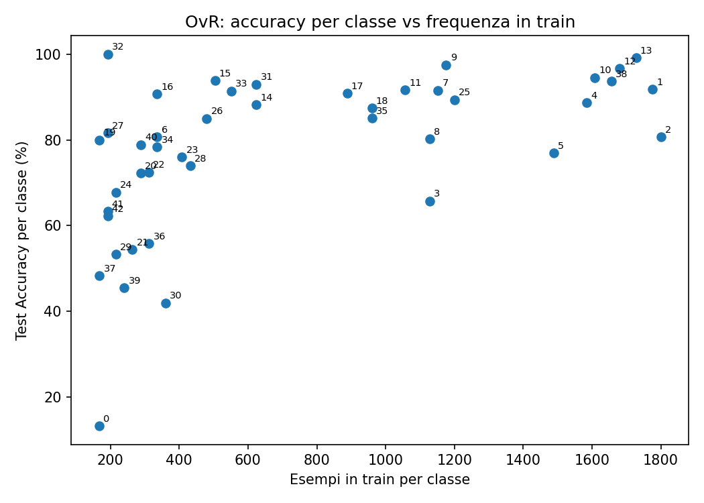

Guardando l'accuracy per classe, l'OvR risulta leggermente peggiore del Softmax nella maggioranza delle classi (28 su 43, 65%) — un piccolo svantaggio diffuso, non isolato in un sottogruppo specifico. Lo script (`src/plot_softmax_ovr.py`) stampa anche il coefficiente di correlazione tra frequenza in train e accuracy di test per classe, per ciascuno dei due modelli: il valore osservato è identico, **0.538**, per entrambi — nonostante Softmax (che valuta tutte le 43 classi congiuntamente) e OvR (43 modelli binari indipendenti, con `pos_weight=40`) abbiano architetture e funzioni di loss diverse. A livello macroscopico, quindi, entrambi i modelli sono limitati dalla stessa carenza di dati: la relazione tra quantità di esempi in train e accuracy di test, mediata su tutte le 43 classi, è la stessa per i due approcci.

Questi due risultati vanno letti insieme. La correlazione identica conferma che, in generale, i due modelli non differiscono per sensibilità alla frequenza delle classi. Lo svantaggio dell'OvR, però, non è uniforme: sulle 10 classi più rare del dataset il calo medio dell'OvR rispetto al Softmax è di **-4.33pt**, più del doppio di quello osservato sul resto delle classi (**-1.2pt** in media). L'OvR resta quindi mediamente un po' peggiore ovunque, ma proprio dove il `pos_weight=40` dovrebbe intervenire di più — le classi più sotto-rappresentate — lo svantaggio si amplifica sensibilmente.

Nello specifico, 0.538 descrive una relazione positiva moderata: c'è una tendenza reale (le classi con più esempi tendono ad avere accuracy di test più alta), ma lontana dal perfetto. Elevando al quadrato (0.538² ≈ 0.29) si ottiene una stima approssimativa di quanta varianza dell'accuracy tra classi sia spiegata dalla sola frequenza in train: circa il 29%, una minoranza. Il restante ~71% dipende da altri fattori — somiglianza visiva tra classi, difficoltà intrinseca del segnale, qualità delle immagini — non dalla quantità di dati. In pratica, questo significa che esistono classi con pochi esempi in train ma alta accuracy in test, perché il segnale è visivamente distintivo (basta poco per impararlo bene), e classi con molti esempi in train ma bassa accuracy in test, perché visivamente simili ad altre (es. due limiti di velocità che si assomigliano), tanto che anche con molti dati il modello continua a confonderle.

In conclusione, il gap val→test più grande dell'OvR non è spiegato da una maggiore sensibilità generale alla scarsità di dati (la correlazione frequenza↔accuracy è identica a quella del Softmax). È invece plausibilmente legato all'amplificazione, nelle classi più rare, dello stesso lieve svantaggio che l'OvR mostra in modo diffuso su gran parte delle classi: il `pos_weight=40` porta il modello a overfittare più fortemente sugli esempi rari specifici visti in train/val, un adattamento che si trasferisce peggio sul test.

### Riepilogo: confronto di tutti gli otto modelli

| Modello | Val Acc | Test Acc | Gap val→test | Class weight (config vincente) |
|---|---|---|---|---|
| **MLP** | 96.77% | **88.12%** (migliore su test) | -8.65pt | (nessuno, non testato) |
| SVM Lineare | 96.12% | 87.47% | -8.65pt | None |
| Softmax | 95.27% | 86.63% | -8.64pt | (nessuno, non testato) |
| OvR | 98.67% | 85.39% | -13.28pt | pos_weight=40 (fisso) |
| SVM RBF | 98.51% | 84.85% | -13.66pt | balanced |
| Decision Tree | 63.27% | 50.22% | -13.05pt | None |
| Random Forest | 92.29% | 77.17% | -15.12pt | balanced |
| AdaBoost | 52.19% | 45.21% | -6.98pt | None |

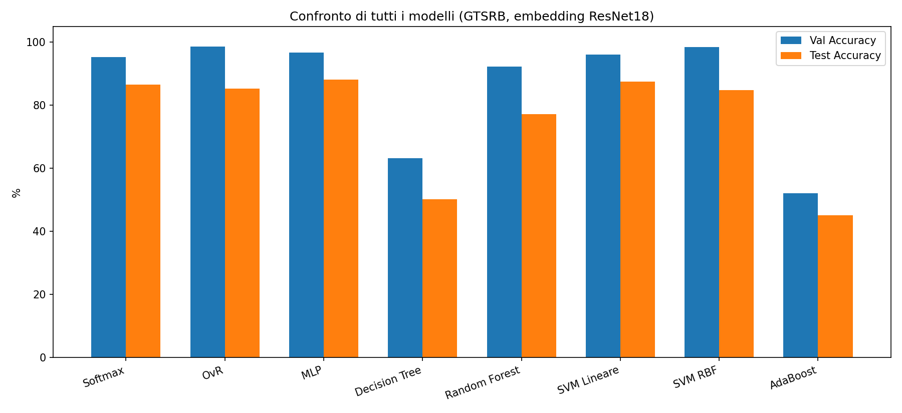

**Osservazione 1 — il migliore su validation non è il migliore su test.** Su validation, OvR e SVM RBF dominavano (~98.5-98.7%), ben sopra Softmax, SVM Lineare e MLP (~95-97%). Sul test la classifica si ribalta quasi del tutto: **l'MLP vince (88.12%)**, seguito da SVM Lineare e Softmax, con OvR e SVM RBF che scivolano in fondo allo stesso gruppo.

**Osservazione 2 — il gap val→test è più grande, in media, quando la pesatura contribuisce davvero al risultato della config vincente.** Ordinando gli otto modelli per gap:

| Gap | Modello | Class weight vincente |
|---|---|---|
| -6.98pt | AdaBoost | None |
| -8.64pt | Softmax | nessuno |
| -8.65pt | SVM Lineare | None |
| -8.65pt | MLP | nessuno |
| -13.05pt | Decision Tree | None *(eccezione, causa diversa — vedi sotto)* |
| -13.28pt | OvR | pos_weight=40 |
| -13.66pt | SVM RBF | balanced *(effetto trascurabile, causa diversa — vedi sotto)* |
| **-15.12pt** | **Random Forest** | **balanced** |

I quattro modelli col gap più piccolo (≤8.65pt) hanno **tutti** vinto senza alcuna pesatura per classi rare — l'MLP conferma il pattern con un gap (-8.65pt) praticamente identico a quello di SVM Lineare. Dei quattro modelli col gap più grande (≥13pt), però, solo **due** (OvR e Random Forest) hanno un gap attribuibile alla pesatura con un meccanismo verificato: nell'OvR l'analisi per-classe mostra l'amplificazione dello svantaggio sulle classi rare (sezione precedente); nel Random Forest la pesatura migliora la validation (+3.4pt) inducendo un adattamento più specifico ai pochi esempi rari visti in train/val. Gli altri due hanno un gap altrettanto grande ma con **causa diversa, non la pesatura**: il Decision Tree vince *senza* pesatura (overfitting classico da varianza, un albero senza vincoli di profondità); la SVM RBF vince nominalmente con `class_weight='balanced'`, ma nella sua sezione dedicata lo stesso accorgimento si è già rivelato avere un effetto trascurabile (0.1-0.5pt) — il suo gap è spiegato dal kernel troppo flessibile su 512 dimensioni (overfitting topologico), non dallo sbilanciamento. Il pattern "pesatura → gap più grande" regge quindi solo per metà dei modelli col gap grande, non per tutti e quattro.

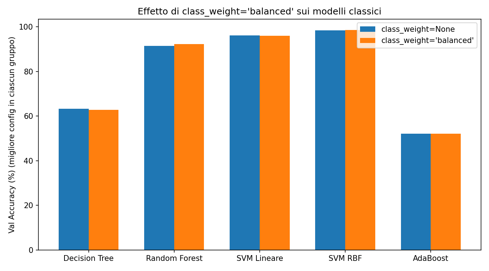

**Ipotesi esplicativa**: pesare per le classi rare fa sì che il modello si adatti più strettamente agli esempi rari *specifici* presenti in train/val; se il test proviene da condizioni/sequenze diverse, quell'adattamento molto specifico si trasferisce peggio — amplificando il calo. È una spiegazione plausibile e verificata per OvR e Random Forest; per Decision Tree e SVM RBF il gap altrettanto grande ha un'origine diversa (varianza classica e overfitting topologico, rispettivamente — si veda "Sintesi dei risultati ottenuti" in Conclusioni).

## Demo

La demo è un'interfaccia grafica realizzata in **Tkinter** (`src/demo.py`) che permette di testare interattivamente tutti e otto i modelli del progetto sopra la stessa pipeline di inferenza usata in training: immagine → ritaglio ROI (se nota) → `ResNet18` (embedding 512-d) → modello scelto → classe predetta.

**Nota sui pesi dei modelli**: i file dei pesi (`.pth`/`.joblib`) non sono inclusi nel repository git per tenerlo leggero — sono disponibili già pronti, senza bisogno di alcun training, come archivio unico nella release del repository:

**[\[link diretto\]](https://github.com/giuseppe-aiello/unict-ml-year-25-group-AIELLO/releases/download/v1.0-results/pesi_modelli.zip)**

Per usarli:
1. Scaricare `pesi_modelli.zip` dal link sopra.
2. Estrarlo nella cartella `results/` del repository (l'archivio va estratto *dentro* `results/`, non nella root del progetto). Al termine, `results/` dovrebbe contenere le sottocartelle `features/` (embedding ResNet18 precalcolati), `models/` (pesi Softmax/OvR/MLP), `models_classical/` (pesi Decision Tree/Random Forest/SVM/AdaBoost) e `models_mlp/` (riepilogo della grid search MLP).
3. A questo punto sia la demo (`python src/demo.py`) sia gli script `evaluate_*.py`/`plot_*.py` funzionano immediatamente, senza rieseguire alcun training.

### Come è organizzato il codice

- **`InferenceEngine`**: carica la ResNet18 una sola volta all'avvio; carica ciascuno degli 8 modelli **solo alla prima selezione** (lazy loading con cache), dato che alcuni file sono pesanti (es. Random Forest ~594 MB). I percorsi ai pesi delle configurazioni vincenti (`MODEL_INFO`) e le metriche di riferimento (`MODEL_METRICS`, val/test accuracy da `docs/report.md`) sono definiti come dizionari in testa al file.
- **`DemoApp`**: costruisce l'interfaccia e gestisce gli eventi (cambio modello, caricamento immagine, esecuzione inferenza).
- Le classi PyTorch (`SoftmaxClassifier`, `MLPClassifier`, `LogisticRegression`) e il preprocessing (`get_feature_extractor`, `get_transforms`) sono **riusati direttamente** da `src/models.py` e `src/feature_extraction.py`, non riscritti — così la demo è garantita fedele alla pipeline usata per produrre i risultati in Esperimenti.
- Tutti i percorsi (dataset, modelli) sono calcolati **relativamente alla posizione dello script** (`__file__`), non hardcoded: la demo funziona su qualunque macchina clonando semplicemente il repository, senza modifiche.

### Come si usa

1. Avviare da terminale, dalla root del progetto:
   python src/demo.py
2. Scegliere un modello dal menu a tendina in alto (Softmax, OvR, MLP, Decision Tree, Random Forest, SVM Lineare, SVM RBF, AdaBoost) — subito sotto compaiono le sue statistiche di riferimento (Val Accuracy, Test Accuracy, gap).
3. Caricare un'immagine con uno dei due pulsanti:
- **"Carica da Test Set"** → apre il test set ufficiale (`data/Test/`); la ground truth è nota (da `Test.csv`) e l'immagine viene ritagliata sulla ROI esattamente come in training.
- **"Carica immagine libera"** → qualunque immagine dal disco; la ground truth risulta "sconosciuta" e non viene applicato alcun ritaglio ROI (limite noto, l'immagine va idealmente già inquadrata sul segnale).
4. La demo mostra immediatamente: l'immagine caricata, l'icona e la classe di ground truth (se nota), e per la predizione — classe, icona, confidenza, esito (corretta/sbagliata, colorato), tempo di inferenza in millisecondi e le top-3 classi più probabili.
5. Cambiando modello dal menu a tendina, la stessa immagine viene ri-classificata all'istante, permettendo un confronto diretto tra i risultati degli otto metodi sullo stesso input.

### Tutorial

Avvio della demo da terminale (PowerShell, con il virtual environment del progetto già attivo):

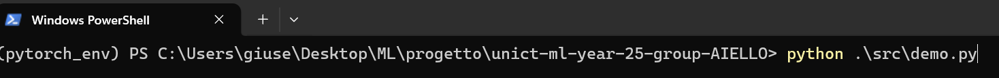

Video dimostrativo dell'utilizzo della demo (selezione modello, caricamento immagine da test set e libera, lettura dei risultati): `media/tutorial-2.mp4` (allegato alla consegna).

## Codice

**Nota sui pesi dei modelli**: come già indicato in Demo, i file dei pesi (`.pth`/`.joblib`) non sono inclusi nel repository git per tenerlo leggero — sono disponibili già pronti nell'archivio unico della release ([link diretto](https://github.com/giuseppe-aiello/unict-ml-year-25-group-AIELLO/releases/download/v1.0-results/pesi_modelli.zip)), da estrarre dentro `results/`.

### Struttura del repository

Tutto il codice sorgente è in `src/`, organizzato per responsabilità:

**Preprocessing e architetture (condivisi da tutti gli script):**
- `feature_extraction.py` — estrae gli embedding ResNet18 a 512-d da tutte le immagini (train e test ufficiali), applica lo split train/val 80/20 stratificato, salva tutto in `results/features/gtsrb_resnet18_feats.npz`. È il primo script da eseguire, prerequisito per ogni fase successiva.
- `models.py` — le tre architetture PyTorch usate nel progetto (`SoftmaxClassifier`, `MLPClassifier`, `LogisticRegression` per l'OvR).
- `utils.py` — `FeatureDataset`, il `Dataset` PyTorch che carica gli embedding già estratti dal file `.npz` per l'uso con `DataLoader`.

**Softmax e OvR:**
- `training.py` — funzioni di training (`train_softmax`, `train_logistic_ovr`, oltre a `train_mlp`), con SGD + early stopping.
- `run_experiment.py` — script eseguibile: esegue la grid search completa (16 configurazioni × Softmax e OvR), salva i pesi di ogni configurazione in `results/models/exp_.../` e le curve in `grid_search_results.json`.
- `evaluation.py` — funzioni (`evaluate_softmax`, `evaluate_ovr_global`, `find_best_config`) per selezionare la configurazione migliore e misurarne l'accuracy sul test set ufficiale.

**MLP:**
- `train_mlp.py` — script eseguibile: grid search (24 configurazioni), riusa `train_mlp` da `training.py`.
- `evaluate_mlp.py` — script eseguibile: valuta la configurazione migliore sul test set.

**Modelli classici (Decision Tree, Random Forest, SVM, AdaBoost):**
- `train_<modello>.py` — script eseguibile: grid search specifica, salva `best_model.joblib` e `grid_search_results.json` in `results/models_classical/<modello>/`.
- `evaluate_<modello>.py` — script eseguibile: carica `best_model.joblib` e misura l'accuracy sul test set ufficiale.

**Grafici e figure del report:**
- `plot_dataset_overview.py`, `plot_curves.py`, `plot_softmax_ovr.py`, `plot_softmax_vs_mlp.py`, `plot_mlp.py`, `plot_decision_tree.py`, `plot_random_forest.py`, `plot_svm.py`, `plot_adaboost.py`, `plot_comparisons.py` — ciascuno genera le figure `media/*.png` usate nella sezione Esperimenti, a partire dai `grid_search_results.json`/`.npz` già salvati.

**Demo:**
- `demo.py` — interfaccia grafica Tkinter per testare gli 8 modelli interattivamente (descritta nella sezione Demo).

**Nota sulla cartella `results/`**: l'intero contenuto (feature ResNet18 precalcolate, pesi di tutte le configurazioni di grid search, modelli finali dei 4 classici, tutti i `grid_search_results.json`) non è incluso nel repository git per tenerlo leggero — è lo stesso archivio già indicato in Demo e a inizio Codice, da estrarre dentro `results/`.

### Come farlo funzionare

1. Installare le dipendenze: `pip install -r requirements.txt`.
2. Posizionare il dataset GTSRB (ufficiale) sotto `data/` (vedi organizzazione delle cartelle in Dataset).
3. Estrarre gli embedding (una sola volta): `python src/feature_extraction.py`.
4. Per ciascun modello, eseguire il relativo script di training (grid search) e poi quello di test:
   python src/run_experiment.py            # Softmax + OvR (training/grid search)
   python src/evaluation.py                # Softmax + OvR (seleziona la config migliore e valuta sul test)

   python src/train_mlp.py                 # MLP (training/grid search)
   python src/evaluate_mlp.py              # MLP (test)

   python src/train_decision_tree.py       # Decision Tree (training/grid search)
   python src/evaluate_decision_tree.py    # Decision Tree (test)

   python src/train_random_forest.py       # Random Forest (training/grid search)
   python src/evaluate_random_forest.py    # Random Forest (test)

   python src/train_svm.py                 # SVM Lineare + RBF (training/grid search)
   python src/evaluate_svm.py              # SVM Lineare + RBF (test)

   python src/train_adaboost.py            # AdaBoost (training/grid search)
   python src/evaluate_adaboost.py         # AdaBoost (test)

    *in caso di path resolution error, entrare nella cartella /src/ ed eseguire i comandi sopra elencati.*

6. Avviare la demo: `python src/demo.py` (vedi sezione Demo).

### Limite noto

Per Softmax e OvR, la fase di test finale (`evaluate_softmax`, `evaluate_ovr_global` in `evaluation.py`) non è ancora richiamata da uno script eseguibile dedicato, a differenza degli altri sei modelli. Da correggere aggiungendo un piccolo `evaluate_softmax_ovr.py` che carichi la configurazione vincente e richiami queste due funzioni.

## Conclusioni

### Sintesi dei risultati ottenuti

Ho confrontato otto strategie di classificazione — due modelli lineari (Softmax, OvR), un MLP, e quattro classificatori classici (Decision Tree, Random Forest, SVM lineare/RBF, AdaBoost) — sopra gli stessi embedding ResNet18 a 512-d, con una disciplina metodologica identica per tutti e otto: selezione degli iperparametri solo su validation, test toccato una volta sola a selezione conclusa.

**Il modello migliore sul test è l'MLP (88.12%)**, seguito da SVM Lineare (87.47%) e Softmax (86.63%); più indietro OvR (85.39%), SVM RBF (84.85%), Random Forest (77.17%), Decision Tree (50.22%) e AdaBoost (45.21%, il più debole in assoluto — non ha ancora saturato nemmeno a `n_estimators=200`, si veda sotto). **Il modello migliore su validation non è il migliore su test**: OvR e SVM RBF dominavano la classifica di validation (~98.5-98.7%) ma scivolano in fondo su test.

**La scoperta principale** è che il gap val→test non ha un'unica causa comune, ma si spiega con almeno **tre meccanismi distinti** a seconda del modello:

1. **Overfitting da pesatura dello sbilanciamento** (OvR `pos_weight=40`, Random Forest `class_weight='balanced'`, gap -13.28pt e -15.12pt): pesare fortemente gli esempi delle classi rare fa sì che il modello si adatti in modo molto specifico ai pochi esempi rari visti in train/val. Dato che GTSRB è costruito da tracce video (frame consecutivi dello stesso cartello, sezione Dataset), gli esempi di test delle stesse classi rare provengono da tracce/condizioni diverse — quell'adattamento iper-specifico non si trasferisce, il modello "conosce" quegli esempi particolari, non il concetto generale della classe. I quattro modelli con gap piccolo (≤8.65pt: AdaBoost, Softmax, SVM Lineare, MLP) hanno tutti vinto **senza** alcuna pesatura.
2. **Overfitting topologico da alta dimensionalità** (SVM RBF, gap -13.66pt): qui `class_weight` ha un effetto trascurabile (0.1-0.5pt), quindi lo sbilanciamento non è la causa. Il kernel RBF, combinato con 512 dimensioni di input, costruisce confini decisionali molto flessibili e chiusi attorno ai dati di validation (98.51% di val_acc) — un adattamento topologico troppo aderente che non regge sul test.
3. **Overfitting classico da varianza** (Decision Tree, gap -13.05pt, `class_weight=None`): un albero singolo senza vincoli di profondità (`max_depth=20`) si adatta a dettagli specifici del validation set, indipendentemente dallo sbilanciamento — l'unica eccezione al pattern 1, ma con una spiegazione nota e diversa.

Un'indagine successiva di verifica (correlazione tra frequenza in train e accuracy di test per classe, Softmax vs OvR) ha **raffinato** l'ipotesi 1 invece di confermarla in toto: il coefficiente di correlazione globale è identico nei due modelli (0.538) — quindi OvR non è genericamente più sensibile alla scarsità di dati su tutte le 43 classi. Guardando l'accuracy per singola classe, l'OvR è comunque leggermente peggiore del Softmax nella maggioranza delle classi (28 su 43, 65%) — un piccolo svantaggio diffuso, non isolato in un sottogruppo — ma questo divario si **amplifica** sulle classi più rare: -4.33pt medi sulle 10 classi meno rappresentate, contro -1.2pt medi sul resto, proprio dove `pos_weight=40` interviene con più forza. Questo è coerente, a un livello più generale, con un'altra scoperta indipendente del progetto — ma su un regime di iperparametri diverso, non quello della config vincente: sotto una combinazione molto più aggressiva (lr=0.01, mom=0.99, contro lr=0.001, mom=0.9 della config effettivamente valutata sul test), 9 dei 43 classificatori binari OvR (su classi visivamente confondibili) collassano in una "spirale" di instabilità durante il training, mentre gli altri 34 restano sani. Non è lo stesso fenomeno del gap val→test appena discusso: qui il problema è instabilità di training in una config mai scelta come vincitrice, non generalizzazione nella config vincente. Il filo comune è però lo stesso, a un livello più astratto: l'OvR è scomposto in 43 ottimizzazioni indipendenti, senza alcun meccanismo che le leghi tra loro, quindi un sottoinsieme di classi problematiche (qui quelle visivamente confondibili) può danneggiare l'intero gruppo senza che gli altri classificatori se ne accorgano — che il danno si manifesti come instabilità di training (regime aggressivo) o come overfitting di generalizzazione (regime vincente).

Osservazioni di contorno rilevanti: il weight decay ha un impatto marginale su Softmax/OvR nell'intervallo testato, segno che l'overfitting "classico" (pesi troppo grandi) non era il problema dominante per modelli lineari su 512 feature e un dataset ampio. Il Random Forest trae beneficio da `class_weight='balanced'` (+3.4pt) mentre lo stesso accorgimento **danneggia** il Decision Tree singolo (fino a -20pt): il bagging (bootstrap + feature sampling casuale) scorrela la distorsione che la pesatura introduce nei singoli split tra i 300 alberi, e la media la spegne mantenendo il beneficio (più attenzione alle classi rare) — lo stesso principio di riduzione della varianza per cui il Random Forest batte in generale un albero singolo, applicato a questo caso specifico.

### Impatto e contributo del progetto

Ho realizzato un **confronto controllato** di otto famiglie di classificatori (lineari, ensemble, kernel, boosting) sopra la stessa rappresentazione congelata, che isola la scelta del classificatore dalla qualità della rappresentazione — un banco di prova pulito per capire *perché* un metodo generalizza meglio di un altro, non solo *quale* vince: generalizzare bene non dipende dall'essere lineare o non lineare, semplice o ensemble — dipende da quanto la procedura di training/selezione permette al modello di modellare le idiosincrasie specifiche del campione visto (train+val) invece del pattern condiviso dalla classe.

Il progetto fornisce una **dimostrazione empirica concreta dell'accuracy paradox** (il modello migliore su validation non è il migliore su test), motivo diretto per cui la disciplina train/val/test va rispettata rigorosamente.

Il risultato più originale è l'aver **decomposto una correlazione apparentemente unica** (pesatura → gap più grande) in **meccanismi causali distinti per famiglia di modello**: overfitting agli esempi specifici per OvR/Random Forest, overfitting topologico da alta dimensionalità per SVM RBF, overfitting da varianza per Decision Tree.

### Idee per lavori futuri o estensioni

- **Riproducibilità**: fissare i seed (`torch.manual_seed`, `np.random.seed`, shuffle del `DataLoader`) per Softmax/OvR/MLP — oggi non fissati, a differenza di tutti i modelli sklearn (`random_state=42` ovunque).
- **Isolare sperimentalmente l'ipotesi causale principale**: la relazione pesatura↔gap è oggi osservata confrontando modelli/config diverse selezionate su validation, e controllata sullo stesso modello. Si potrebbe ggiungere anche la stessa pesatura variabile come iperparametro in OvR-Softmax. Un lavoro futuro potrebbe essere quello di misurare il test anche per una seconda config "gemella" (stessi iperparametri, solo class_weight diverso) per ciascun modello.
- **Criterio di selezione degli iperparametri**: per OvR, dove l'accuracy soffre di accuracy paradox, usare F1-macro (già calcolato per il reporting) come criterio di selezione al posto di val_loss/val_acc.
- **Quantificare la divergenza nella coda delle classi rare** (Softmax vs OvR): ricalcolare il gap val→test escludendo il piccolo cluster di classi rare/fragili identificate, per verificare se il gap di OvR si avvicina a quello di Softmax — confermerebbe numericamente il meccanismo proposto, secondo cui il `pos_weight=40` dell'OvR forza il modello a dare molto peso agli esempi delle classi rare durante il training, portandolo ad adattarsi troppo strettamente alle caratteristiche particolari degli esempi rari visti in train/val invece di imparare il pattern generale della classe.
- **Estendere la griglia di AdaBoost**: a `n_estimators=200` il modello non ha ancora saturato (crescita monotona senza plateau) — testare 500-1000 round (non fatto per limiti di tempo) probabilmente migliorerebbe il modello più debole del progetto.

- Aggiungere **Cross-validation** al posto di un singolo split train/val fisso, per ridurre il rischio di overfitting sulla scelta stessa degli iperparametri (la grid search ottimizza per quel particolare validation set).
Ciò sarebbe decisivo nel separare "overfitting da class-weighting" da "rumore dello split singolo", inoltre si risolverebbe anche il problema delle classi rare che hanno pochissimi esempi nel singolo validation set dato ogni esempio di ogni classe rara passerebbe per la validation in almeno un fold. 

## Appendici

*Le curve di training (Softmax, OvR, MLP) e tutti i grafici diagnostici per-modello sono ora integrati direttamente nella sezione Esperimenti, vicino alla discussione a cui si riferiscono, per non separare il grafico dal testo che lo spiega.*

### Tabella completa delle 16 configurazioni (Softmax/OvR)

| lr | mom | wd | bs | epoche (SM) | val_loss SM | val_acc SM | epoche (OvR) | val_loss OvR | val_acc OvR |
|---|---|---|---|---|---|---|---|---|---|
| 0.001 | 0.99 | 0.0 | 64 | 50 | **0.152** | 95.27% | 44 | 0.199 | 98.43% |
| 0.01 | 0.9 | 0.0 | 64 | 47 | 0.157 | 95.03% | 42 | 0.164 | 98.78% |
| 0.01 | 0.9 | 0.0001 | 64 | 50 | 0.157 | 95.29% | 50 | 0.171 | 98.51% |
| 0.001 | 0.99 | 0.0001 | 64 | 50 | 0.159 | 95.14% | 50 | 0.207 | 98.02% |
| 0.01 | 0.99 | 0.0001 | 128 | 35 | 0.169 | 94.84% | 39 | 1.182 | 98.22% |
| 0.001 | 0.99 | 0.0 | 128 | 50 | 0.175 | 94.84% | 50 | 0.106 | 98.55% |
| 0.01 | 0.9 | 0.0 | 128 | 50 | 0.176 | 94.86% | 50 | 0.145 | 98.47% |
| 0.01 | 0.9 | 0.0001 | 128 | 50 | 0.181 | 94.80% | 50 | 0.107 | 98.61% |
| 0.001 | 0.99 | 0.0001 | 128 | 50 | 0.182 | 94.55% | 50 | 0.107 | 98.58% |
| 0.01 | 0.99 | 0.0 | 128 | 19 | 0.206 | 94.30% | 26 | 1.449 | 96.56% |
| 0.001 | 0.9 | 0.0 | 64 | 50 | 0.286 | 92.58% | 50 | **0.075** | 98.67% |
| 0.001 | 0.9 | 0.0001 | 64 | 50 | 0.287 | 92.58% | 50 | 0.075 | 98.74% |
| 0.01 | 0.99 | 0.0 | 64 | 22 | 0.321 | 93.83% | 25 | 1.961 | 97.88% |
| 0.001 | 0.9 | 0.0 | 128 | 50 | 0.371 | 91.04% | 50 | 0.080 | 98.43% |
| 0.001 | 0.9 | 0.0001 | 128 | 50 | 0.373 | 90.88% | 50 | 0.082 | 98.38% |
| 0.01 | 0.99 | 0.0001 | 64 | 8 | 0.463 | 90.56% | 50 | 2.363 | 97.63% |

*(ordinata per val_loss Softmax migliore; in grassetto le due configurazioni vincenti, rispettivamente per Softmax e per OvR — vedi Esperimenti)*

## Riferimenti

- Stallkamp, J., Schlipsing, M., Salmen, J., & Igel, C. (2012). *Man vs. computer: Benchmarking machine learning algorithms for traffic sign recognition.* Neural Networks, 32, 323–332. https://doi.org/10.1016/j.neunet.2012.02.016
- Elkan, C. (2001). *The Foundations of Cost-Sensitive Learning.* Proceedings of the 17th International Joint Conference on Artificial Intelligence (IJCAI), 973–978. https://cseweb.ucsd.edu/~elkan/rescale.pdf *(il link è alla copia preprint auto-archiviata dall'autore, che riporta "To appear, Proceedings of IJCAI'01" e non l'impaginazione degli atti ufficiali; i numeri di pagina 973–978 sono quelli della pubblicazione IJCAI ufficiale, non visibili nel PDF linkato)*
- Valverde-Albacete, F. J., & Peláez-Moreno, C. (2014). *100% Classification Accuracy Considered Harmful: The Normalized Information Transfer Factor Explains the Accuracy Paradox.* PLOS ONE, 9(1), e84217. https://doi.org/10.1371/journal.pone.0084217
